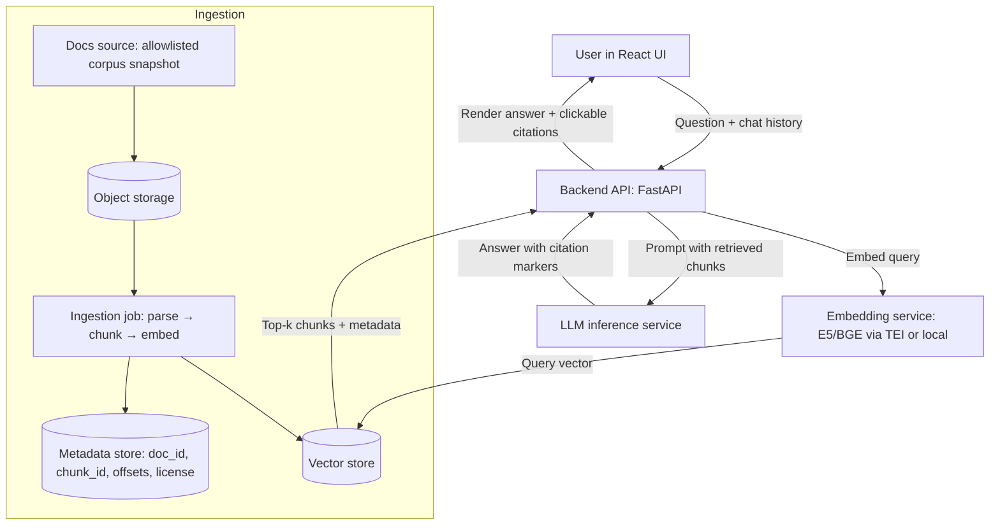
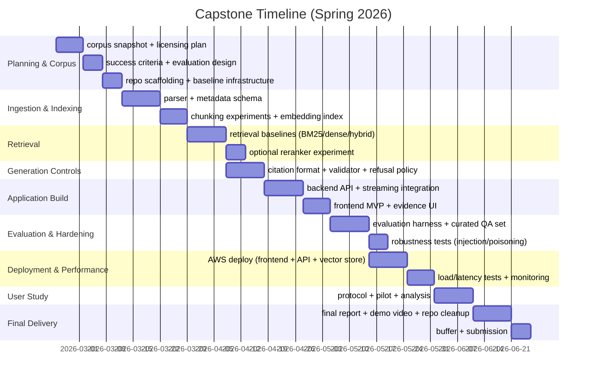

# Capstone Project Proposal - SupportDoc RAG Chatbot with Citations (V13)

**Course:** DS552 – Generative AI  
**Assignment:** Capstone Project Proposal (Web Application Using an Open-Source Pretrained LLM)  
**Student:** Rodrigo Arguello Serrano  
**Date:** 2026-02-19  
**Instructor:** Narahara Chari Dingari, Ph.D.

---

## **1.0 Project title**

### **1.1 Proposed title**

SupportDoc RAG Chatbot with Verifiable Citations (AWS + React)

### **1.2 One-line summary**

A web-based support assistant that answers questions only using an approved documentation corpus and provides clickable citations to the exact source passages.

---

## **2.0 Introduction and objective**

### **2.1 Introduction**

Support teams and users often waste time searching long help articles, versioned manuals, and troubleshooting documentation. Keyword search fails when users phrase questions differently than the docs. A retrieval-augmented chatbot can retrieve semantically relevant passages and generate a concise answer grounded in that evidence, reducing hallucinations by requiring verifiable citations (Lewis et al., 2020; Amazon Web Services, n.d.-e).

**Primary demo claim:**

- The system’s outputs are *grounded and verifiable* via clickable citations to the approved documentation. If evidence is insufficient or citations fail validation, the system **refuses** rather than guessing. Success is demonstrated via citation precision and refusal correctness metrics (§7).


### **2.2 Objective**

Build and evaluate a production-style web application that:

- Ingests an allowlisted documentation set,
- Retrieves relevant passages using embeddings + similarity search,
- Generates answers using an open-source instruct-tuned LLM,
- Attaches citations that trace each sentence/claim back to retrieved evidence, and
- Refuses to answer when evidence is inadequate or validation fails.

### **2.3 Target users / stakeholders**

End users of a software product, support agents, and documentation maintainers.

### **2.4 Core value proposition**

Faster, more consistent answers; reduced time to resolution; improved trust via verifiable citations.

---

## **3.0 Selection of an open-source pretrained LLM**

### **3.1 Chosen model**

- **Model name & version:** **Mistral-7B-Instruct-v0.3** (Mistral AI)  
- **Model source / repository:** Hosted on Hugging Face model hub  
- **License:** Apache-2.0  

### **3.2 Justification**

- **Relevance:** A modern instruction-tuned 7B model is suitable for question answering with constrained style requirements (citation format + refusal behavior), especially when grounded via RAG (Lewis et al., 2020).
- **Accessibility:** 7B-class models are feasible to serve on a single GPU instance for a capstone using efficient serving frameworks (e.g., vLLM) and/or quantization tooling, enabling practical latency testing (Kwon et al., 2023; bitsandbytes contributors, n.d.).
- **Applicability:** The Mistral-7B-Instruct-v0.3 model card describes strong instruction-following behavior and includes guidance for structured outputs and tool/function calling. For this project, structured JSON outputs will be enforced via prompting and/or constrained decoding; tool/function calling may be used where supported to reduce parsing brittleness (Mistral AI, n.d.).
- **Trade-offs:** Smaller open-source models can be more prone to verbosity or subtle hallucinations than frontier hosted models, so strict grounding prompts, similarity thresholds, and evaluation are required (Es et al., 2023; TruLens, n.d.).

### **3.3 Alternatives considered (comparative table)**

| Candidate open(-source/-weight) model | License                   | Pros for this project                                        | Cons / risks                                                 | Why not chosen as baseline                                   |
| :------------------------------------ | :------------------------ | :----------------------------------------------------------- | :----------------------------------------------------------- | :----------------------------------------------------------- |
| Mistral-7B-Instruct-v0.3              | Apache-2.0                | Strong instruction follow; manageable size; permissive license. | Requires careful grounding + safety controls.                | **Chosen baseline.**                                         |
| Mixtral-8x7B-Instruct-v0.1            | Apache-2.0                | Strong quality/cost tradeoff; MoE can outperform larger dense models. | Heavier serving + memory complexity than 7B dense.           | Stretch goal / comparison model.                             |
| Falcon-7B-Instruct                    | Apache-2.0                | Permissive license; widely supported by serving stacks.      | Older; may underperform more recent instruction-tuned models. | Secondary baseline option.                                   |
| BLOOM                                 | BigScience BLOOM RAIL 1.0 | Multilingual breadth; major open-science effort.             | RAIL license adds behavioral restrictions; 176B is impractical. | Not feasible for AWS cost/compute.                           |
| GPT-2                                 | Modified MIT              | Very easy to run; permissive code license.                   | Not instruction-tuned; weaker for constrained, grounded QA.  | Not strong enough for primary demo.                          |
| Llama 3                               | Custom community license  | Strong performance; broad ecosystem.                         | Custom license constraints complicate “open-source” framing. | Use only if course permits “open weights under custom license.” |

---

## **4.0 Project definition and use case**

### **4.1 Application concept**

Document-grounded chatbot / question answering system.

### **4.2 Primary user story**

As a support agent (or end user), a natural-language question about a product should return a concise answer with citations to the exact relevant documentation passage, enabling fast resolution and independent verification.

### **4.3 How the LLM is utilized**

- **Inputs:** user question + conversation context (last N turns) + retrieved doc chunks (top-k).
- **Outputs:** final answer plus citations per sentence/claim, with a structured mapping from citation markers to source metadata.
- **Prompting strategy:** strict system prompt enforcing “answer only from provided context,” mandatory citations, and refusal when the context is insufficient (aligned with groundedness evaluation concepts).
- **RAG:** embeddings + similarity search to select relevant passages as non-parametric context (Lewis et al., 2020; Amazon Web Services, n.d.-e).
- **Fine-tuning:** none required for the baseline; optional LoRA later if time permits for stricter style conformance.

### **4.4 Documentation corpus and licensing plan (initial scope lock)**

This project will use a single primary corpus for the deployed application and a separate set of evaluation datasets for benchmarking.

#### **4.4.1 Primary corpus for the deployed application**

- **Primary corpus:** Kubernetes documentation (kubernetes.io) as an open, well-structured “support docs” knowledge base with clear attribution requirements (CC BY 4.0) (Kubernetes Documentation, n.d.; Creative Commons, n.d.).
- **Snapshot strategy:** ingest from a fixed snapshot of the documentation source (e.g., a specific Git commit or release tag), recorded in metadata for reproducibility.
- **Format:** Markdown/HTML content converted into structured sections prior to chunking.
- **Expected size (order-of-magnitude):** hundreds to low-thousands of pages/sections; after chunking, on the order of **5k–30k chunks** (depending on chunk size/overlap). Exact counts and total tokens will be measured and reported at ingestion.
- **Attribution workflow (CC BY 4.0):** store `source_url`, `license`, and an attribution string per document/chunk; render attribution in the UI (e.g., “Kubernetes Documentation © The Kubernetes Authors — CC BY 4.0”) and include source URLs in exported evaluation artifacts (Kubernetes Documentation, n.d.; Creative Commons, n.d.).
- **Question types targeted:** installation/setup, configuration, troubleshooting, definitions, and best-practice guidance.
- **Corpus sizing plan:** record the exact number of pages/sections/chunks and total token count at ingestion time (reported in the evaluation report).

#### **4.4.2 Benchmark datasets for evaluation (not deployed as production corpus)**

- **Doc2Dial / MultiDoc2Dial:** used to measure retrieval and evidence-grounded answering on datasets that include document-grounded contexts (Feng et al., 2020; Feng et al., 2021).
- **Project-specific test set:** a small, manually curated set of “answerable” and “unanswerable” questions written against the Kubernetes corpus snapshot to stress-test refusal behavior, citation correctness, and injection resilience.

### **4.5 Scope boundaries**

#### **4.5.1 In scope**

- Document ingestion (allowlisted sources only)
- Parsing, chunking, embedding
- Vector search retrieval (dense and hybrid baselines)
- Citation-aware answer generation
- Evidence-based refusal behavior
- Evaluation harness + metrics
- AWS deployment
- Performance measurement (latency, TTFT, throughput, resource usage)

#### **4.5.2 Out of scope**

- Fully automated doc authoring
- Multi-tenant enterprise permissions
- High-stakes decision support (medical/legal/financial)

---

## **5.0 Implementation plan**

### **5.1 Technology stack proposed**

- **Model & inference:** vLLM (PagedAttention) or Hugging Face TGI for serving; Transformers for experimentation (Kwon et al., 2023; Hugging Face, n.d.-a).
- **Embeddings:** E5 or BGE family; optionally served via Hugging Face TEI (Wang et al., 2022; Hugging Face, n.d.-b).
- **Web framework:** FastAPI backend + React frontend (AWS hosting)
- **Vector store:** Amazon OpenSearch Service/Serverless vector search collections OR PostgreSQL pgvector OR FAISS for simplest local baseline (Amazon Web Services, n.d.-e; pgvector contributors, n.d.; Johnson et al., 2017).
- **Evaluation:** RAGAS + custom citation metrics; optional TruLens tracing (Es et al., 2023; TruLens, n.d.).
- **Deployment:** AWS Amplify Hosting (frontend), ECS with Fargate (API), and GPU inference hosted on EC2 or managed via SageMaker endpoints (Amazon Web Services, n.d.-a; Amazon Web Services, n.d.-c).

### **5.2 Development steps (milestone-oriented)**

1. Corpus snapshot + ingestion pipeline (parse → chunk → embed → index) with provenance metadata.
2. Retrieval baselines (BM25-only, dense-only, hybrid) and initial tuning of top-k.
3. Citation format + backend citation validator + refusal policy implementation.
4. API orchestration and streaming response integration; React UI evidence rendering.
5. Evaluation harness with curated and benchmark test sets; metric reporting.
6. AWS deployment and systems testing (latency, TTFT, load).

---

## **6.0 Technical architecture and design decisions**

### **6.1 RAG pipeline architecture (conceptual)**

RAG combines parametric generation with retrieval from a dense vector index, improving factual specificity and enabling provenance when the generation is constrained to retrieved evidence (Lewis et al., 2020). Dense retrievers using dual encoders (DPR-style) are a strong baseline for semantic retrieval and can outperform BM25 on open-domain QA retrieval accuracy when trained appropriately (Karpukhin et al., 2020), while BM25 remains a robust baseline across heterogeneous retrieval datasets (Thakur et al., 2021; Robertson, 2009).



### **6.2 Vector store options and retrieval strategy**

Vector search in Amazon OpenSearch Service supports semantic similarity search using embeddings rather than keyword matching; OpenSearch also supports k-NN operations in a vector space (Amazon Web Services, n.d.-e). OpenSearch Serverless provides a “vector search collection” type for managed similarity search for generative AI apps without managing vector DB infrastructure.

Retrieval will be treated as an experimentally tuned component, because retrieval errors propagate to generation even with a strong model (Lewis et al., 2020; Karpukhin et al., 2020).

A pragmatic retrieval plan (baseline + controlled comparisons):

- **Baseline A (lexical):** BM25-only retrieval.
- **Baseline B (semantic):** dense-only retrieval (E5/BGE) with cosine similarity.
- **System C (recommended):** Hybrid retrieval will use score normalization and/or Reciprocal Rank Fusion (RRF) for merging lexical + dense candidate sets.
- **Optional D:** hybrid + cross-encoder reranker on the top 20 candidates (precision boost; latency cost).

**Winner selection rule:** choose the configuration that maximizes **recall@k** and **context precision** on the labeled dev set, with **latency impact** reported (retrieval time and end-to-end TTFT). The default `k` will start at 8–10 and be tuned as part of this selection.

### **6.3 Chunking and embedding strategy**

Chunking is a primary control knob for retrieval quality: too large increases noise and token cost; too small fragments meaning and harms recall. Chunk size and overlap will be treated as tunable IR parameters and evaluated using retrieval recall@k and context precision (Es et al., 2023; Thakur et al., 2021).

#### **6.3.1 Recommended baseline approach**

- Parse docs into a structured representation (Markdown/HTML → sections).
- Chunk at section/subsection boundaries, then apply a max token cap (e.g., 350–800 tokens) with moderate overlap (e.g., 50–120 tokens).
- Store chunk metadata: `{doc_id, doc_title, section_path, chunk_id, start_offset, end_offset, source_url, license, snapshot_id}`.

#### **6.3.2 Embedding model candidates**

- **E5:** trained for general-purpose text embeddings and retrieval tasks (Wang et al., 2022).
- **BGE (FlagEmbedding):** includes multilingual/long-input variants such as BGE-M3 (Chen et al., 2024).
- **Sentence-Transformers:** strong bi-encoder ecosystem; SBERT motivates why bi-encoders are efficient for similarity search at scale (Reimers & Gurevych, 2019).
- **Serving boundary:** embeddings may be served via Hugging Face TEI to maintain a clean microservice boundary when testing throughput.

### **6.4 Citation extraction and provenance design**

RAG’s core advantage is that retrieved passages can serve as explicit evidence; however, the trust guarantee only holds when provenance is preserved and exposed in the UI and when citations are validated against retrieved evidence (Lewis et al., 2020).

A citation system suitable for this capstone:

- Each retrieved chunk has a stable `chunk_id` mapping to a specific doc section and offsets.
- The LLM must include citations in a strict format, e.g., after each sentence: `...[1]` (numeric markers mapped to chunk metadata via the structured citation list).
- The backend validates citations:
  - parse citations and ensure each referenced chunk is in the retrieved set,
  - reject or regenerate answers that cite non-retrieved chunks,
  - render citations as expandable evidence cards showing the chunk text and source metadata.

Self-RAG reports improvements in factuality and citation accuracy via retrieval + reflection signals, reinforcing that “citation quality” is measurable and improvable (Asai et al., 2023).

#### **6.4.1 Structured output contract (JSON)**

To reduce parsing brittleness and make validation deterministic, generation will be constrained to a structured schema (via function-calling/tooling when available, or strict JSON-only prompting):

```json
{
  "final_answer": "string",
  "citations": [
    {
      "marker": "[1]",
      "doc_id": "string",
      "chunk_id": "string",
      "start_offset": 0,
      "end_offset": 0
    }
  ],
  "refusal": {
    "is_refusal": false,
    "reason_code": "insufficient_evidence | no_relevant_docs | citation_validation_failed | out_of_scope",
    "message": "string"
  }
}
```

**Citation validity rules (enforced by the backend):**

- A citation is **invalid** if it references a chunk not in the retrieved set for that request (blocked → regenerate or refuse).
- A citation is **invalid** if its offsets fall outside the stored chunk bounds.
- A citation is **invalid** if `refusal.is_refusal = true` but `final_answer` contains substantive claims.

The UI can still render a clean “answer + clickable citations” view, but the backend will rely on this contract for validation and logging.

### **6.5 Evidence-based refusal policy (operational definition)**

Refusal behavior will be implemented as a deterministic policy enforced by the backend, rather than relying solely on model compliance.

#### **6.5.1 Retrieval sufficiency gating**

Let `k` be the number of retrieved chunks and `s_i` be similarity scores (dense or hybrid-normalized). The system will refuse if any of the following conditions hold:

- **Low top score:** `s_1 < T_top1`
- **Low overall evidence:** `mean(s_1..s_3) < T_mean3`
- **Insufficient supporting chunks:** fewer than `N_support` chunks exceed a minimum support threshold `T_support`

**Initial configuration (to be calibrated on a dev set):**

- `k = 8`
- `N_support = 2`
- `L_thin_max = 3` sentences (cap answer length when evidence barely clears thresholds)
- `T_top1`, `T_mean3`, and `T_support` chosen to maximize refusal correctness on unanswerable questions while keeping false refusals acceptable on answerable questions (reported with explicit rates).

#### **6.5.2 Citation and grounding enforcement**

- **Every sentence must cite:** The backend treats each sentence (including bullet items) as a claim and requires at least one citation marker per sentence. Sentence segmentation will use a deterministic splitter (e.g., punctuation-based with guardrails for abbreviations).
- **Citation allowlist:** each citation marker must reference a chunk present in the retrieved context for that request.
- **Validation failure handling:** if validation fails, the backend will (a) regenerate with stricter constraints (limited retries) or (b) refuse with a structured explanation (“no adequate evidence in the approved corpus”).

#### **6.5.3 Refusal response format**

Refusals will be explicit and structured (see the JSON contract in §6.4.1):

- a short refusal statement,
- a machine-readable reason code (e.g., `insufficient_evidence`, `no_relevant_docs`, `citation_validation_failed`, `out_of_scope`),
- optional suggested next step (“provide product version,” “specify component,” “link the relevant doc page”).

**When to say “I don’t know” vs “no relevant documentation found”:**

- **`no_relevant_docs`:** retrieval returns no chunks above a very low floor (e.g., `s_1 < T_nohit`) → “No relevant documentation found in the approved corpus.”
- **`insufficient_evidence`:** some relevant text is retrieved, but it does not fully support answering the question under the citation rules → “I don’t know based on the retrieved documentation.”


### **6.6 Infrastructure layer: AWS deployment architecture (mapped to the RAG pipeline)**

This subsection maps the conceptual RAG pipeline above to deployable AWS components. Detailed service selection trade-offs and cost scenarios are described in **§9.2–§9.3**.

**Deployment components (baseline):**

- **Frontend (UI):** React SPA hosted on **AWS Amplify Hosting** (Amazon Web Services, n.d.-g).
- **Backend (orchestration + policy enforcement):** **FastAPI** container on **ECS Fargate**, responsible for retrieval orchestration, prompt construction, **citation validation**, and **refusal gating** (Amazon Web Services, n.d.-a).
- **Retrieval layer (vector store):** **OpenSearch vector search / Serverless vector search collections** *or* **RDS Postgres + pgvector**, depending on the final simplicity/cost trade-off (Amazon Web Services, n.d.-e; pgvector contributors, n.d.).
- **Object storage (corpus + artifacts):** **S3** for corpus snapshots, ingestion outputs (chunks + metadata), and evaluation artifacts.
- **Inference layer (LLM serving):**
  - **Option A:** self-hosted GPU inference on **EC2** (vLLM/TGI) behind the API for predictable control (Kwon et al., 2023; Hugging Face, n.d.-a).
  - **Option B:** managed real-time inference via **SageMaker** for simpler ops/scaling (stretch path) (Amazon Web Services, n.d.-c).

**Scalability and observability (what will be measured and monitored):**

- **p50/p95 latency**, **TTFT**, throughput, GPU memory/VRAM, and retrieval latency (as defined in §7.3.5).
- The architecture allows independent scaling of the **API**, **retrieval**, and **inference** components; CloudWatch logs/metrics (and optional OpenTelemetry traces) provide the evidence needed to diagnose bottlenecks during load testing (Amazon Web Services, n.d.-f; OpenTelemetry, 2025).


---

## **7.0 Model evaluation criteria and success criteria**

### **7.1 Primary claim and evaluation framing**

The project’s primary technical claim is:

> The system produces answers that are verifiable: each sentence is grounded in retrieved documentation and backed by valid citations; otherwise the system refuses.

The evaluation plan is organized to directly test this claim, with supporting measurements for retrieval quality and system performance.

### **7.2 Evaluation datasets and test sets**

- **Primary (project-specific):** a curated QA set written against the Kubernetes corpus snapshot, including:
  - answerable questions with expected evidence sections,
  - unanswerable questions designed to trigger refusal (missing docs, out-of-scope, ambiguous).
- **Benchmark (secondary):** Doc2Dial and MultiDoc2Dial subsets for evidence-grounded evaluation, used to compute retrieval and answer metrics where gold contexts are available.

### **7.3 Automatic and manual metrics**

#### **7.3.1 Retrieval metrics**

- **Recall@k:** whether the gold evidence chunk appears in top-k (where gold evidence is available).
- **Context precision / relevance:** the fraction of retrieved chunks judged relevant (manual sampling + optional RAGAS/TruLens signals).
- **Latency (retrieval):** vector DB query time and total retrieval stage time.

#### **7.3.2 Answer quality metrics**

- **Exact Match (EM) / token-level F1:** when benchmark reference answers exist (e.g., Doc2Dial-like formats) (Rajpurkar et al., 2016).
- **Human ratings:** clarity, usefulness, and consistency with citations on a stratified sample of outputs.

#### **7.3.3 Groundedness and citation correctness**

- **Faithfulness / groundedness (RAGAS-style):** measure alignment between answer and retrieved evidence (Es et al., 2023).
- **Citation precision (primary):** A citation is **correct** if the cited chunk contains the needed fact(s) or logically supports the claim, and the claim does not introduce new entities/steps not present in the cited text. A citation is **invalid** if it points to a non-supporting (or contradicting) chunk or any chunk not in the retrieved set for that request (blocked by the validator). This will be estimated via manual annotation on a stratified sample, with LLM-judge checks reported only as secondary evidence.

#### **7.3.4 Refusal correctness**

- **Should-refuse accuracy:** fraction of unanswerable questions correctly refused.
- **False refusal rate:** fraction of answerable questions incorrectly refused.
- **Partial refusal quality:** when partial evidence exists, measure whether the system answers only supported subclaims and refuses unsupported parts.

#### **7.3.5 Efficiency and systems metrics**

- **End-to-end latency:** p50/p95 request latency.
- **Time-to-first-token (TTFT):** measured for streaming UX.
- **Throughput:** tokens/second and concurrent user capacity.
- **Resource usage:** GPU VRAM, CPU/RAM, and vector DB performance under load.

#### **7.3.6 Robustness and security tests**

- Prompt injection attempts aligned to OWASP LLM guidance (direct and indirect injection) (OWASP Foundation, 2024).
- Corpus poisoning simulations (controlled “bad doc” scenarios) to validate ingestion controls and retrieval monitoring (OWASP Foundation, 2024; Zou et al., 2024).

### **7.4 Experimental comparisons**

At minimum, the following retrieval configurations will be compared under identical evaluation conditions:

- BM25-only baseline
- Dense-only baseline (E5/BGE)
- Hybrid retrieval (BM25 + dense)
- Optional: hybrid + reranker (if time permits)

### **7.5 Success criteria (measurable targets)**

Targets will be tuned to the final corpus and compute budget and will be reported with confidence intervals where appropriate:

- Retrieval: Recall@5 ≥ 0.80 on a labeled grounded set (domain dependent).
- Citation precision ≥ 0.85 on a manually reviewed sample.
- Refusal correctness ≥ 0.90 on the unanswerable subset; false refusal rate ≤ 0.10 on answerable subset.
- p95 TTFT ≤ 2.0s on a defined “demo load” concurrency scenario.
- Faithfulness/groundedness improvement vs a “no-retrieval” baseline (RAGAS/TruLens) (Es et al., 2023; TruLens, n.d.).

---

## **8.0 Expected outcomes and challenges**

### **8.1 Expected outcomes (what “success” looks like)**

If executed as designed, the project is expected to deliver:

- **Grounded support answers that are verifiable:** users can click citations to inspect the exact supporting documentation passages.
- **Reduced hallucination risk by construction:** unsupported claims are blocked by the “every sentence must cite” rule and backend citation validation.
- **Operationally measurable quality:** the final report will quantify citation precision, groundedness/faithfulness, refusal correctness, retrieval recall@k, and end-to-end latency/TTFT (as defined in §7).
- **A realistic “production-style” demo:** deployed as a small but complete web app (frontend + API + retrieval + inference) with logs/metrics sufficient to diagnose failures and iterate.

### **8.2 Anticipated challenges and mitigation approach**

Key challenges for a capstone-scale RAG system—and how this proposal addresses them:

- **Retrieval misses propagate to generation:** mitigated by baseline comparisons (BM25 vs dense vs hybrid), tuning `k`, and (optionally) reranking (§6.2, §7.4).
- **Citation mapping can be brittle:** mitigated by a structured JSON output contract plus deterministic backend validation (§6.4.1).
- **Latency and cost constraints (GPU + vector search):** mitigated by streaming output, measuring TTFT, and using a “minimum viable deployment” with cost scenarios (§7.3.5, §9.2.1, §9.3).
- **Prompt injection and corpus poisoning risk:** mitigated by allowlisting/snapshots, treating retrieved text as untrusted, and executing explicit robustness tests (§7.3.6, §9.4).

---

## **9.0 Timeline, AWS resources and cost estimates, risks**

### **9.1 Implementation timeline (Spring 2026; date-corrected)**



### **9.2 AWS service selection (comparative table)**

#### **9.2.1 Minimum viable deployment (baseline plan)**

To keep the build achievable and the architecture reviewable, the project will commit to one baseline deployment path, with AWS-native upgrades treated as stretch goals:

- **Frontend:** Amplify Hosting (React SPA)
- **API:** ECS Fargate running FastAPI (orchestrates retrieval + inference calls, enforces validation/refusal)
- **Vector store (baseline):** **RDS Postgres + pgvector** (managed, simple ops) *or* FAISS for early local prototyping
- **Inference:** single **EC2 GPU** instance running vLLM (or TGI) behind the API
- **Logging/metrics:** CloudWatch Logs + structured JSON logs (latency, TTFT, refusal rates, citation validation outcomes)

**Privacy/logging posture (what will *not* be stored by default):** the deployed system will avoid persisting raw user prompts, full chat transcripts, or complete model outputs by default. Operational logs will focus on metrics and identifiers (e.g., latency/TTFT, retrieval configuration, top-k IDs, refusal reason codes, and citation validation outcomes). Any content capture for debugging will be explicitly enabled, redacted for secrets/PII, and retained only for a short troubleshooting window.

**Stretch/upgrade path (if time permits):** migrate retrieval to **OpenSearch Serverless vector search** (or managed OpenSearch) and/or move inference to **SageMaker real-time** for managed scaling.

| Layer         | Primary option                                               | Alternative                                                 | Why                                                          | Key citations (APA inline)                                   |
| :------------ | :----------------------------------------------------------- | :---------------------------------------------------------- | :----------------------------------------------------------- | :----------------------------------------------------------- |
| React hosting | Amplify Hosting                                              | S3 + CloudFront                                             | Managed CI/CD + CDN-backed hosting for React SPA             | (Amazon Web Services, n.d.-g; Amazon Web Services, n.d.-b)   |
| API backend   | ECS on Fargate                                               | Lambda (response streaming)                                 | Containerized API orchestration vs serverless streaming responses | (Amazon Web Services, n.d.-a; Amazon Web Services, n.d.-d)   |
| Vector DB     | OpenSearch vector search / Serverless vector search collections | RDS/Aurora + pgvector (optionally FAISS for local baseline) | Managed vector search vs Postgres-native vectors (and research-grade ANN baseline) | (Amazon Web Services, n.d.-e; pgvector contributors, n.d.; Johnson et al., 2017) |
| LLM inference | EC2 GPU self-host (vLLM/TGI)                                 | SageMaker real-time endpoint                                | Efficient high-throughput serving vs fully managed autoscaling endpoints | (Kwon et al., 2023; Hugging Face, n.d.-a; Amazon Web Services, n.d.-c) |
| Observability | CloudWatch Logs + structured app logs                        | OpenTelemetry-compatible tracing stack                      | Centralized logs/metrics plus vendor-neutral instrumentation | (Amazon Web Services, n.d.-f; OpenTelemetry, 2025)           |

### **9.3 AWS cost estimates (order-of-magnitude)**

Major cost drivers are typically **GPU inference** and **vector search**. Final numbers will be computed from official AWS pricing pages for the chosen region and reported in two scenarios:

| Component                          | Pricing unit (typical)        | Always-on scenario (for realism)         | Demo-hours scenario (capstone-friendly)                  |
| ---------------------------------- | ----------------------------- | ---------------------------------------- | -------------------------------------------------------- |
| GPU inference (EC2)                | $/GPU-hour                    | 24×7 during the final integration window | Only during demos/tests (e.g., scheduled blocks)         |
| Vector store (pgvector/OpenSearch) | $/instance-hour or $/OCU-hour | Always-on managed service                | Keep smallest tier; stop when not in use (if applicable) |
| API (ECS Fargate)                  | $/vCPU-hour + $/GB-hour       | 1–2 tasks always-on                      | Scale to 0/1 task when idle (where feasible)             |
| Storage (S3)                       | $/GB-month + requests         | Corpus snapshot + logs retained          | Same; dominated by corpus size                           |
| Observability (CloudWatch)         | $/GB ingested + retention     | Full logs retained for evaluation        | Shorter retention window                                 |

For the capstone, the default operational configuration will use the demo-hours scenario, with always-on deployment enabled only during final integration, performance testing, and evaluation windows.

The report will include the specific instance types/service tiers selected and the measured runtime hours used (inference, retrieval, and load tests).

### **9.4 Risk analysis and mitigations**

RAG systems expand the attack surface because the model consumes both user input and retrieved documents, motivating prompt-injection and corpus poisoning defenses (OWASP Foundation, 2024; Greshake et al., 2023; Zou et al., 2024).

| Risk                                                         | Why it matters                                               | Mitigation (proposal-level commitments)                      | Supporting sources                                  |
| :----------------------------------------------------------- | :----------------------------------------------------------- | :----------------------------------------------------------- | :-------------------------------------------------- |
| Hallucinated/unsupported answers                             | Breaks trust; violates the citations contract                | Strict grounding prompts; retrieval sufficiency gating; backend citation validation; measure groundedness and citation precision. | Lewis et al., 2020; Es et al., 2023; TruLens, n.d.  |
| Prompt injection (direct and indirect)                       | User or retrieved text can override instructions             | Instruction hierarchy; treat retrieved docs as untrusted; output validation; least-privilege tool access. | OWASP Foundation, 2024; Greshake et al., 2023       |
| Sensitive data disclosure (user secrets/PII in prompts/logs) | Users may paste API keys/tokens or PII; storing raw prompts/logs can create security and compliance risk | UI warning (“do not paste secrets”); server-side redaction/secret scanning; minimize retention; store hashed IDs/metrics rather than raw content when possible | OWASP Foundation, 2024; Amazon Web Services, n.d.-f |
| Corpus poisoning / knowledge corruption                      | Persistent manipulation of retrieval results                 | Allowlist sources; snapshot/versioning; checksums; monitor anomalous retrieval; evaluate “poisoned” cases. | Zou et al., 2024; OWASP Foundation, 2024            |
| Cost overruns (GPU + managed vector DB)                      | Deployment may become infeasible                             | Start with FAISS/pgvector; enforce token budgets; limit always-on GPU hours; record and report cost drivers. | Kwon et al., 2023; Johnson et al., 2017             |
| Scalability / latency                                        | Poor UX; weakens “production-style” claim                    | Streaming responses; TTFT measurement; efficient serving (vLLM/TGI); caching for repeated queries. | Kwon et al., 2023; Hugging Face, n.d.-a             |

---

## **10.0 System Architecture Overview**

This project implements a layered Retrieval-Augmented Generation (RAG) architecture designed to ensure grounded, citation-enforced responses over Kubernetes documentation. The system is structured across three clearly defined layers to promote modularity, scalability, and reproducibility:

- **Model Layer** – Pretrained and/or fine-tuned language models sourced from the Hugging Face Hub  
- **Application Layer** – Document ingestion, indexing, retrieval, generation, citation enforcement, and refusal logic  
- **Infrastructure Layer** – AWS-based deployment environment providing compute, storage, API serving, and scalability  

This separation ensures model artifacts, retrieval logic, and infrastructure concerns remain independently configurable while functioning cohesively. The AWS infrastructure mapping is summarized in **§6.6** and expanded with service selection/cost considerations in **§9.2–§9.3**.

---

### **10.1 End-to-End Workflow**

1. Corpus snapshot ingestion (allowlisted Kubernetes documentation)
2. Parsing → structured chunking → metadata preservation
3. Embedding via Hugging Face–sourced embedding model
4. Vector indexing (OpenSearch / pgvector / FAISS)
5. Query embedding + top-k retrieval
6. Prompt construction with retrieved context
7. LLM generation (Hugging Face model)
8. Citation validation + refusal gating
9. Render answer + clickable citations in UI

---

## **11.0 Application Layer: RAG Pipeline and Citation Enforcement**

### **11.1 Document Ingestion and Metadata Design**

Kubernetes documentation is ingested from a fixed snapshot. Each chunk stores:

- doc_id  
- doc_title  
- section_path  
- chunk_id  
- offsets  
- source_url  
- license  
- snapshot_id  

This guarantees reproducibility and attribution compliance (CC BY 4.0) (Kubernetes Documentation, n.d.; Creative Commons, n.d.).

---

### **11.2 Embedding Model (Model Layer Integration)**

Embedding models are sourced from the Hugging Face Hub (e.g., E5, BGE).  
Version pinning ensures reproducibility.

---

### **11.3 Retrieval Strategy**

Configurations evaluated:

- BM25-only  
- Dense-only  
- Hybrid (BM25 + dense)  
- Optional reranker  

Configuration chosen based on recall@k + citation precision + latency trade-offs.

---

### **11.4 Generation Model**

- **Model:** Mistral-7B-Instruct-v0.3  
- **Source:** Hugging Face Hub  
- **License:** Apache-2.0  

Inference options:

- Hugging Face Inference Endpoint  
- Self-hosted on AWS GPU instance  

Prompt enforces:

- Use only retrieved context  
- Cite every sentence  
- Refuse if insufficient evidence  

---

### **11.5 Citation Enforcement and Refusal Policy**

Backend validates:

- Every sentence must contain citation marker(s)  
- Each marker references a chunk present in the retrieved set  
- Citation offsets are valid relative to stored chunk bounds  
- Refusal is triggered when evidence thresholds are not met  

Refusal reason codes:

- insufficient_evidence  
- no_relevant_docs  
- citation_validation_failed  
- out_of_scope  

---

## **12.0 Related Work and Open-Source Implementation References**

To ground the proposed system design in established engineering practices, several open-source RAG implementations were reviewed.

Architectural layers:

- Model Layer → Hugging Face Hub  
- Application Layer → RAG frameworks + citation enforcement  
- Infrastructure Layer → AWS  

---

### **12.1 Application-Level RAG Baseline**

### **k8s-docs-assistant-rag**

https://github.com/dongminlee94/k8s-docs-assistant-rag  

- Kubernetes documentation RAG pipeline  
- Markdown ingestion + embedding retrieval  
- Domain-aligned baseline  

---

### **PrivateGPT**

https://github.com/imartinez/privateGPT  

- Minimal RAG implementation  
- FAISS-based retrieval  
- Open-source LLM integration  

---

### **12.2 RAG Frameworks**

- **LlamaIndex** – https://github.com/run-llama/llama_index  
- **Haystack** – https://github.com/deepset-ai/haystack  
- **LangChain** – https://github.com/langchain-ai/langchain  

---

### **12.3 Infrastructure References**

- AWS Multi-Tenant RAG Workshop  
- Helm-based RAG deployments  

---

### **12.4 Architectural Layer Clarification**

- Hugging Face Hub → Model sourcing  
- RAG frameworks → Application logic  
- AWS → Deployment infrastructure  

This layered architecture ensures modularity and reproducibility.

---

**Note:** Repository links were verified for accessibility at the time of proposal submission.

---

## **13.0 Conclusion**

This proposal specifies a document-grounded support assistant implemented with a standard RAG pipeline and an open-source instruct-tuned LLM. The design emphasizes verifiability: every answer is constrained to an allowlisted documentation snapshot and must provide validated citations per sentence; when evidence is inadequate or validation fails, the system refuses. Success will be demonstrated through retrieval quality, citation correctness, refusal correctness, and measurable systems performance under realistic deployment constraints.

**Definition of Done (capstone-ready):**

- Deployed web app (React + FastAPI) answering against the Kubernetes documentation snapshot with **per-sentence citations**.
- Backend **citation validator** enforcing the citation allowlist + evidence-based **refusal policy**, with refusal reason codes logged.
- Retrieval comparison completed and reported: **BM25 vs dense vs hybrid** (optional reranker if time permits), including recall@k/context precision and latency impact.
- Evaluation report includes **citation precision**, groundedness/faithfulness, **should-refuse** + **false-refusal** rates, and p50/p95 latency + **TTFT**.
- Reproducibility artifacts in the repo: corpus snapshot ID, ingestion counts/tokens, and end-to-end run instructions.

---

## **14.0 References**

Amazon Web Services. (2023, June 21). *Amazon OpenSearch Service’s vector database capabilities explained*. AWS Big Data Blog. https://aws.amazon.com/blogs/big-data/amazon-opensearch-services-vector-database-capabilities-explained/

Amazon Web Services. (n.d.-a). *Architect for AWS Fargate for Amazon ECS*. Retrieved February 19, 2026, from https://docs.aws.amazon.com/AmazonECS/latest/developerguide/AWS_Fargate.html

Amazon Web Services. (n.d.-b). *Hosting a static website using Amazon S3*. Retrieved February 19, 2026, from https://docs.aws.amazon.com/AmazonS3/latest/userguide/WebsiteHosting.html

Amazon Web Services. (n.d.-c). *Real-time inference (Amazon SageMaker AI)*. Retrieved February 19, 2026, from https://docs.aws.amazon.com/sagemaker/latest/dg/realtime-endpoints.html

Amazon Web Services. (n.d.-d). *Response streaming for Lambda functions*. Retrieved February 19, 2026, from https://docs.aws.amazon.com/lambda/latest/dg/configuration-response-streaming.html

Amazon Web Services. (n.d.-e). *Vector search (Amazon OpenSearch Service)*. Retrieved February 19, 2026, from https://docs.aws.amazon.com/opensearch-service/latest/developerguide/vector-search.html

Amazon Web Services. (n.d.-f). *What is Amazon CloudWatch Logs?* Retrieved February 19, 2026, from https://docs.aws.amazon.com/AmazonCloudWatch/latest/logs/WhatIsCloudWatchLogs.html

Asai, A., et al. (2023). *Self-RAG: Learning to retrieve, generate, and critique through self-reflection* (arXiv:2310.11511). arXiv. https://arxiv.org/abs/2310.11511

bitsandbytes contributors. (n.d.). *bitsandbytes* [Source code]. GitHub. Retrieved February 19, 2026, from https://github.com/bitsandbytes-foundation/bitsandbytes

Chen, J., et al. (2024). *BGE-M3: Multi-lingual, multi-functionality, multi-granularity text embeddings* (arXiv preprint). arXiv.

Creative Commons. (n.d.). *Attribution 4.0 International (CC BY 4.0).* Retrieved February 19, 2026, from https://creativecommons.org/licenses/by/4.0/

Es, S., James, J., Espinosa-Anke, L., & Schockaert, S. (2023). *RAGAS: Automated evaluation of retrieval augmented generation* (arXiv:2309.15217). arXiv. https://arxiv.org/abs/2309.15217

Greshake, K., Abdelnabi, S., Mishra, S., Endres, C., Holz, T., & Fritz, M. (2023). *Not what you’ve signed up for: Compromising real-world LLM-integrated applications with indirect prompt injection* (arXiv:2302.12173). arXiv. https://arxiv.org/abs/2302.12173

Hugging Face. (n.d.-a). *Text Generation Inference (TGI) documentation*. Retrieved February 19, 2026, from https://huggingface.co/docs/text-generation-inference/index

Hugging Face. (n.d.-b). *Text Embeddings Inference (TEI) documentation*. Retrieved February 19, 2026, from https://huggingface.co/docs/text-embeddings-inference/index

Johnson, J., Douze, M., & Jégou, H. (2017). *Billion-scale similarity search with GPUs* (arXiv:1702.08734). arXiv. https://arxiv.org/abs/1702.08734

Karpukhin, V., Oguz, B., Min, S., Lewis, P., Wu, L., Edunov, S., Chen, D., & Yih, W.-t. (2020). *Dense passage retrieval for open-domain question answering*. In *Proceedings of the 2020 Conference on Empirical Methods in Natural Language Processing (EMNLP)* (pp. 6769–6781). Association for Computational Linguistics. https://doi.org/10.18653/v1/2020.emnlp-main.550

Kwon, W., Li, Z., Zhuang, S., Sheng, Y., Zheng, L., Yu, C. H., Gonzalez, J. E., Zhang, H., & Stoica, I. (2023). *Efficient memory management for large language model serving with PagedAttention* (arXiv:2309.06180). arXiv. https://arxiv.org/abs/2309.06180

Lewis, P., Perez, E., Piktus, A., Petroni, F., Karpukhin, V., Goyal, N., Küttler, H., Lewis, M., Yih, W.-t., Rocktäschel, T., Riedel, S., & Kiela, D. (2020). *Retrieval-augmented generation for knowledge-intensive NLP tasks* (arXiv:2005.11401). arXiv. https://arxiv.org/abs/2005.11401

OpenTelemetry. (2025, August 29). *Documentation*. https://opentelemetry.io/docs/

OWASP Foundation. (2024). *OWASP Top 10 for LLMs (v2025)* [PDF]. https://owasp.org/www-project-top-10-for-large-language-model-applications/assets/PDF/OWASP-Top-10-for-LLMs-v2025.pdf

pgvector contributors. (n.d.). *pgvector* [Source code]. GitHub. Retrieved February 19, 2026, from https://github.com/pgvector/pgvector

Rajpurkar, P., Zhang, J., Lopyrev, K., & Liang, P. (2016). *SQuAD: 100,000+ questions for machine comprehension of text*. In *Proceedings of the 2016 Conference on Empirical Methods in Natural Language Processing* (pp. 2383–2392). Association for Computational Linguistics.

Reimers, N., & Gurevych, I. (2019). *Sentence-BERT: Sentence embeddings using Siamese BERT-networks*. In *Proceedings of the 2019 Conference on Empirical Methods in Natural Language Processing*.

Robertson, S. E., & Zaragoza, H. (2009). *The probabilistic relevance framework: BM25 and beyond*. *Foundations and Trends® in Information Retrieval, 3*(4), 333–389. https://doi.org/10.1561/1500000019

Thakur, N., Reimers, N., Daxenberger, J., & Gurevych, I. (2021). *BEIR: A heterogeneous benchmark for zero-shot evaluation of information retrieval models*. arXiv. https://arxiv.org/abs/2104.08663

TruLens. (n.d.). *RAG triad*. Retrieved February 19, 2026, from https://www.trulens.org/getting_started/core_concepts/rag_triad/

Wang, L., et al. (2022). *Text embeddings by weakly-supervised contrastive pre-training* (E5). arXiv. https://arxiv.org/abs/2212.03533

Zou, W., Geng, R., Wang, B., & Jia, J. (2024). *PoisonedRAG: Knowledge corruption attacks to retrieval-augmented generation of large language models* (arXiv:2402.07867). arXiv. https://arxiv.org/abs/2402.07867

Kubernetes Documentation. (n.d.). *Kubernetes Documentation – About the documentation*. Retrieved February 19, 2026, from https://kubernetes.io/docs/home/

Amazon Web Services. (n.d.-g). *Welcome to AWS Amplify Hosting*. Retrieved February 19, 2026, from https://docs.aws.amazon.com/amplify/latest/userguide/welcome.html

Feng, S., Wan, H., Gunasekara, C., Patel, S. S., Joshi, S., & Lastras, L. A. (2020). *doc2dial: A goal-oriented document-grounded dialogue dataset*. In *Proceedings of the 2020 Conference on Empirical Methods in Natural Language Processing (EMNLP)*. Association for Computational Linguistics. https://aclanthology.org/2020.emnlp-main.652/

Feng, S., Patel, S. S., Wan, H., & Joshi, S. (2021). *MultiDoc2Dial: Modeling dialogues grounded in multiple documents*. In *Proceedings of the 2021 Conference on Empirical Methods in Natural Language Processing (EMNLP)*. Association for Computational Linguistics. https://aclanthology.org/2021.emnlp-main.498/

Mistral AI. (n.d.). *mistralai/Mistral-7B-Instruct-v0.3* [Model card]. Hugging Face. Retrieved February 19, 2026, from https://huggingface.co/mistralai/Mistral-7B-Instruct-v0.3
