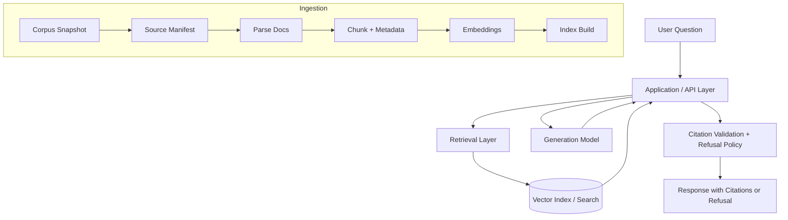

## 1. Project Overview

SupportDoc RAG Chatbot is a document-grounded support assistant that answers user questions using an approved documentation corpus and provides verifiable citations to the exact supporting source passages. The project is designed to reduce hallucinations by combining retrieval-augmented generation (RAG), citation validation, and explicit refusal behavior when evidence is missing or insufficient. The initial deployed corpus for the project is a pinned snapshot of Kubernetes documentation, selected for its technical depth, structured format, and permissive CC BY 4.0 licensing. :contentReference[oaicite:2]{index=2}

The long-term goal is to deliver a production-style web application with a clear separation between ingestion, retrieval, generation, validation, and deployment concerns. At a high level, the system ingests an allowlisted documentation snapshot, converts it into structured chunks with provenance metadata, retrieves relevant evidence for a user query, generates an answer using an open-source LLM, and returns citations for each supported claim. If the retrieved evidence is weak, incomplete, or fails validation, the system refuses rather than guessing. :contentReference[oaicite:3]{index=3}

---

## 2. Current Status

This README is maintained as a **live project document** and will evolve as the implementation progresses.

### Current Phase
Project foundation and corpus-governance setup.

### Completed
- Repository scaffolding for application, ingestion, retrieval, evaluation, and documentation.
- Initial corpus governance documentation in `docs/data/corpus.md`.
- Initial ingestion pipeline diagram in `docs/diagrams/ingestion_pipeline.md`.
- Initial manifest generator in `src/supportdoc_rag_chatbot/ingestion/build_manifest.py`.
- Example source manifest in `data/manifests/source_manifest.jsonl`.
- Corpus decision to use Kubernetes documentation as the primary support-doc knowledge base.
- Snapshot strategy selected: **Git commit hash** for reproducible corpus versioning.

### In Progress
- Finalizing the pinned Kubernetes documentation snapshot ID and snapshot date.
- Refining corpus allowlist / denylist rules.
- Preparing the ingestion workflow beyond manifest generation (parse → chunk → metadata validation).

### Next Up
- Implement document parsing into structured sections.
- Implement chunking with stable chunk IDs and provenance metadata.
- Add embeddings and initial vector index.
- Build retrieval smoke tests and answer generation contract.
- Integrate citation validation and refusal logic into the backend pipeline. :contentReference[oaicite:6]{index=6}

---

## 3. Architecture Overview

The project follows a three-layer architecture:

### Model Layer
This layer contains the core ML components used for embeddings and answer generation. The current plan is to use an open-source instruct-tuned LLM as the generation baseline, with **Mistral-7B-Instruct-v0.3** as the proposed default model. For retrieval embeddings, the project is currently oriented around **E5** or **BGE** family models. These components are treated as replaceable so the system can compare retrieval and generation behavior without changing the rest of the application structure.

### Application Layer
This is the main orchestration layer implemented in this repository. It is responsible for:
- corpus ingestion,
- manifest generation,
- parsing and chunking,
- retrieval orchestration,
- answer generation,
- citation validation, and
- refusal enforcement.

The application layer is the core of the project because the main technical claim is not just “generate answers,” but “generate grounded answers with valid citations, or refuse when the evidence is not good enough.”

### Infrastructure Layer
The intended deployment target is an AWS-backed web application with a frontend, backend API, vector search layer, and model-serving component. The proposal currently targets a React-based UI, a FastAPI backend, object storage for artifacts, and a vector store such as FAISS, pgvector, or OpenSearch depending on the stage of the project. This layer is planned incrementally and will be documented further as deployment work is completed.

### High-Level System Flow

## 5. Repository Structure

## 6. Corpus and Licensing

##  7. Local Development

##  8. Citations and Refusal Behavior

##  9. Evaluation Plan / Results

##  10. Deployment Overview

##  11. Documentation Map / Roadmap
