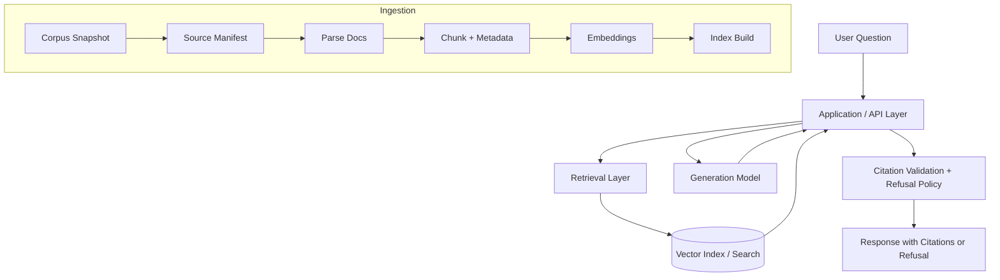

## 1. Project Overview

SupportDoc RAG Chatbot is a document-grounded support assistant that answers user questions using an approved documentation corpus and provides verifiable citations to the exact supporting source passages. The project is designed to reduce hallucinations by combining retrieval-augmented generation (RAG), citation validation, and explicit refusal behavior when evidence is missing or insufficient.

The long-term goal is to deliver a production-style web application with a clear separation between ingestion, retrieval, generation, validation, and deployment concerns. At a high level, the system ingests an allowlisted documentation snapshot, converts it into structured chunks with provenance metadata, retrieves relevant evidence for a user query, generates an answer using an open-source LLM, and returns citations for each supported claim. If the retrieved evidence is weak, incomplete, or fails validation, the system refuses rather than guessing.

The initial corpus is a pinned snapshot of Kubernetes documentation so the project can iterate on retrieval, answer grounding, and citation validation against a reproducible support-doc dataset.

---

## 2. Current Status

This README is maintained as a live project document and evolves with each completed task issue.

### Current Phase
Trust-layer response contract plus prompt rules scaffolded with a canonical schema, versioned policy text, and deterministic prompt snapshots.

### Completed
- Repository scaffolding for application, ingestion, retrieval, evaluation, and documentation.
- Corpus governance documentation in `docs/data/corpus.md`.
- Ingestion pipeline artifacts for manifest generation, parsing, section extraction, chunking, and validation.
- Stable `chunks.jsonl` artifact with chunk-level provenance metadata.
- Local embedding job that converts `data/processed/chunks.jsonl` into deterministic dense-vector artifacts for downstream index construction.
- Local FAISS backend that builds, persists, reloads, and searches a dense index over saved embedding artifacts.
- Developer-facing retrieval smoke CLI for local dense search over a saved FAISS index.
- Shared retrieval evaluation harness plus dense, BM25, and hybrid baseline runners that execute the committed Dev QA set and write deterministic result artifacts.
- Retrieval comparison note documenting baseline configs, reference fixture metrics, trade-offs, and the provisional default retrieval mode for later epics.
- Canonical trust-layer `QueryResponse` schema with Pydantic validation, checked-in JSON Schema, example answer/refusal fixtures, and a local trust smoke command.
- Reusable trust-layer prompt builder with versioned policy text, untrusted-context delimiters, and deterministic golden prompt snapshots.

### In Progress
- Citation validation against retrieved evidence spans.
- Retrieval sufficiency gating before final answer emission.

### Next Up
- Wire prompt-generation outputs onto the canonical trust response contract.
- Connect citation validation and refusal gating to the provisional hybrid retrieval default.
- Expand deployment and observability documentation as the backend/API layer matures.

---

## 3. Architecture Overview

The project follows a three-layer architecture:

### Model Layer
This layer contains the ML components used for embeddings and answer generation. For local retrieval development, the project currently defaults to a lightweight sentence-transformers embedding model suitable for laptop workflows, while keeping the embedding model configurable so E5, BGE, or hosted embedding backends can be swapped in later.

### Application Layer
This is the main orchestration layer implemented in this repository. It is responsible for:
- corpus ingestion,
- manifest generation,
- parsing and chunking,
- embedding artifact generation,
- retrieval orchestration,
- answer generation,
- citation validation, and
- refusal enforcement.

### Infrastructure Layer
The intended deployment target is an AWS-backed web application with a frontend, backend API, vector search layer, and model-serving component. The proposal currently targets a React-based UI, a FastAPI backend, object storage for artifacts, and a vector store such as FAISS, pgvector, or OpenSearch depending on the stage of the project.

### High-Level System Flow



---

## 4. Embedding Artifacts (Local MVP)

The local embedding step is intentionally backend-agnostic. It reads the canonical chunk artifact and writes:

- a row-major float32 vector artifact,
- a small JSON metadata artifact, and
- no index-specific files yet.

Default output paths:

- `data/processed/embeddings/chunk_embeddings.f32`
- `data/processed/embeddings/chunk_embeddings.metadata.json`

The metadata file records at least:

- source chunks path,
- embedding model name,
- vector dimension,
- row count,
- snapshot ID when all chunk rows share the same snapshot, and
- vector artifact path.

This keeps the embedding job reusable by FAISS, pgvector, or any later retrieval backend.

---


## 4A. Local FAISS Index Artifacts (MVP)

The first dense retrieval backend uses FAISS with a flat inner-product index. For cosine-similarity-compatible retrieval, the backend L2-normalizes database vectors before adding them to `IndexFlatIP`, then normalizes query vectors before search.

Default output paths:

- `data/processed/indexes/faiss/chunk_index.faiss`
- `data/processed/indexes/faiss/chunk_index.metadata.json`
- `data/processed/indexes/faiss/chunk_index.row_mapping.json`

The metadata sidecar records at least:

- backend name,
- metric,
- embedding model name,
- vector dimension,
- row count,
- source chunks path,
- embedding metadata path,
- vector artifact path, and
- snapshot ID when available.

The row-mapping artifact stores the chunk IDs in row order so the FAISS index can stay focused on vector search while chunk provenance remains in the original `chunks.jsonl` artifact.

---

## 5. Repository Structure

```text
src/supportdoc_rag_chatbot/
  ingestion/              # Manifest, parse, chunk, validation pipeline
  retrieval/
    embeddings/           # Local embedding job + artifact I/O
    indexes/              # Dense index interfaces + local FAISS backend
    smoke.py              # Developer-facing dense retrieval smoke helpers
  app/                    # Backend orchestration entrypoints (to grow over time)
  evaluation/             # Dev QA loading, retrieval harness, and baseline runners
  resources/              # Default config and packaged resources

data/
  manifests/              # Source manifests
  parsed/                 # Section-level parsed artifacts
  processed/              # Chunk, embedding, and index artifacts

docs/
  adr/                    # Architecture decisions
  data/                   # Corpus and licensing docs
  diagrams/               # Architecture / ingestion diagrams
  process/                # Repo workflow and governance docs
```

---

## 6. Corpus and Licensing

The current MVP corpus is a pinned Kubernetes documentation snapshot. Corpus governance, allowlist rules, and licensing decisions are documented in `docs/data/corpus.md` and the ADRs under `docs/adr/`.

---

## 7. Local Development

### Base environment

For normal repo development:

```bash
uv sync --locked --extra dev-tools
```

### Embedding job dependencies

For local embedding work, install the optional embedding dependencies too:

```bash
uv sync --locked --extra dev-tools --extra embeddings-local
```

### FAISS index dependencies

For local FAISS index work, install the FAISS extra:

```bash
uv sync --locked --extra dev-tools --extra faiss
```

If you want to run both the local embedding job and the local FAISS backend on the same machine, install both extras together:

```bash
uv sync --locked --extra dev-tools --extra embeddings-local --extra faiss
```

### Run the embedding job

After you have `data/processed/chunks.jsonl`, run:

```bash
uv run python -m supportdoc_rag_chatbot embed-chunks \
  --input data/processed/chunks.jsonl \
  --vectors-output data/processed/embeddings/chunk_embeddings.f32 \
  --metadata-output data/processed/embeddings/chunk_embeddings.metadata.json \
  --model-name sentence-transformers/all-MiniLM-L6-v2
```

Useful options:

- `--device cpu|cuda|mps`
- `--batch-size 32`
- `--no-normalize`

### Build the local FAISS index

After the embedding artifacts exist, build the persisted FAISS index:

```bash
uv run python -m supportdoc_rag_chatbot build-faiss-index \
  --embedding-metadata data/processed/embeddings/chunk_embeddings.metadata.json \
  --index-output data/processed/indexes/faiss/chunk_index.faiss \
  --index-metadata-output data/processed/indexes/faiss/chunk_index.metadata.json \
  --row-mapping-output data/processed/indexes/faiss/chunk_index.row_mapping.json
```

### Load the saved FAISS backend from Python

```python
from pathlib import Path

from supportdoc_rag_chatbot.retrieval.indexes import load_faiss_index_backend

backend = load_faiss_index_backend(
    index_path=Path("data/processed/indexes/faiss/chunk_index.faiss"),
    metadata_path=Path("data/processed/indexes/faiss/chunk_index.metadata.json"),
)
```

### Run a local dense-retrieval smoke test

After the FAISS index exists, run a query end to end:

```bash
uv run python -m supportdoc_rag_chatbot smoke-dense-retrieval \
  --query "what is a pod" \
  --top-k 3 \
  --index data/processed/indexes/faiss/chunk_index.faiss \
  --index-metadata data/processed/indexes/faiss/chunk_index.metadata.json
```

By default, the smoke command:

- loads the embedding model recorded in the FAISS index metadata,
- uses the row-mapping path recorded in the index metadata,
- uses the source `chunks.jsonl` path recorded in the index metadata, and
- prints rank, score, chunk ID, section path, source URL, and a short text preview.

Useful options:

- `--row-mapping data/processed/indexes/faiss/chunk_index.row_mapping.json`
- `--chunks data/processed/chunks.jsonl`
- `--model-name sentence-transformers/all-MiniLM-L6-v2`
- `--device cpu|cuda|mps`
- `--preview-chars 200`

### Local verification

Run the standard local verification pass:

```bash
uv sync --locked --extra dev-tools --extra faiss --extra bm25
uv run ruff check . --fix
uv run ruff format .
uv run ruff format --check .
uv run pre-commit run --all-files
uv run pytest -q tests/test_dense_retrieval_baseline.py tests/test_bm25_baseline.py tests/test_hybrid_baseline.py
uv run pytest -q
```

### Run the local trust-contract smoke test

```bash
uv run python -m supportdoc_rag_chatbot smoke-trust-schema \
  --schema docs/contracts/query_response.schema.json \
  --answer-fixture docs/contracts/query_response.answer.example.json \
  --refusal-fixture docs/contracts/query_response.refusal.example.json
```

---

## 8. Citations and Refusal Behavior

The repository now includes a canonical trust-layer response contract under `src/supportdoc_rag_chatbot/app/schemas/trust.py`. That contract defines structured supported answers, structured refusals, restricted refusal reason codes, and deterministic JSON Schema export under `docs/contracts/`.

Citation validation and refusal gating are still being layered into the backend pipeline, but later Epics can now reuse one checked-in `QueryResponse` contract instead of duplicating ad hoc response dictionaries.

The trust-layer prompt builder now lives under `src/supportdoc_rag_chatbot/app/services/prompting.py`, while the backend-agnostic policy wording and version log live in `policies/prompt_rules.md`. The builder renders a replaceable model preamble, embeds the canonical `QueryResponse` JSON Schema, and clearly marks retrieved chunks as untrusted data instead of instructions.

---

## 9. Evaluation Plan / Results

Evaluation work is planned in two stages:

1. retrieval smoke tests and baseline relevance checks,
2. end-to-end answer quality, citation support, and refusal correctness.

Results will be documented under the evaluation package and in future project reports as those baselines are implemented.

## 9A. Development Retrieval QA Set

A small versioned development QA set now lives under `data/evaluation/` for retrieval-only baseline work. The current committed dataset targets snapshot `k8s-9e1e32b` from `data/manifests/source_manifest.jsonl` and includes answerable plus intentionally unanswerable questions, along with expected section/chunk evidence IDs for retrieval checks.

The evaluation helpers in `src/supportdoc_rag_chatbot/evaluation/dev_qa.py` can load the dataset, load the companion metadata/registry files, and validate that every annotated evidence ID belongs to the same snapshot. See `docs/process/retrieval_dev_qa.md` for the schema, annotation rules, and validation workflow.

## 9B. Hybrid Retrieval Baseline Evaluation

The repository now includes a hybrid baseline runner that combines dense FAISS retrieval with BM25 lexical retrieval using Reciprocal Rank Fusion (RRF). The hybrid baseline collects ranked candidates from both component retrievers, merges duplicate chunk IDs deterministically, and writes deterministic artifacts under `data/evaluation/runs/` by default.

Default hybrid baseline command:

```bash
uv run python -m supportdoc_rag_chatbot run-hybrid-baseline \
  --chunks data/processed/chunks.jsonl \
  --index data/processed/indexes/faiss/chunk_index.faiss \
  --index-metadata data/processed/indexes/faiss/chunk_index.metadata.json \
  --top-k 5
```

The hybrid run writes:

- a per-query results JSONL artifact
- a summary JSON artifact with hit@k, recall@k, MRR, and latency

See `docs/process/hybrid_retrieval_baseline.md` for the default fusion strategy, exact baseline configuration, and output layout.

## 9C. Retrieval Comparison Note

A retrieval-only comparison note now lives at `docs/process/retrieval_comparison_notes.md`. It records the current Epic 4 baseline configs, reference fixture metrics from the shared evaluation harness, qualitative trade-offs, and a **provisional default recommendation of `hybrid-rrf`** for follow-on work.

Because the repository does not commit local processed chunk / embedding / FAISS artifacts, the comparison note distinguishes between reproducible fixture metrics and future corpus-level runs that can be regenerated locally when those artifacts exist.

---

## 10. Deployment Overview

The intended deployment path is a FastAPI backend with a web frontend, persistent artifact storage, a vector retrieval layer, and a replaceable generation backend. The local MVP keeps artifacts simple so the deployment architecture can evolve without rewriting the ingestion or embedding steps.

---

## 11. Documentation Map / Roadmap

- `docs/process/git_workflow.md` — branch / PR / lockfile workflow
- `docs/data/corpus.md` — corpus scope and licensing notes
- `docs/diagrams/ingestion_pipeline.md` — ingestion pipeline overview
- `docs/adr/` — architecture decisions and project rationale
- `docs/process/hybrid_retrieval_baseline.md` — default hybrid baseline config and run command
- `docs/process/retrieval_comparison_notes.md` — Epic 4 baseline comparison and provisional default selection
- `docs/process/trust_response_contract.md` — canonical response contract, schema artifact, and smoke command
- `policies/prompt_rules.md` — trust-layer generation policy, citation rules, refusal instructions, and version log
- `PROPOSAL.md` — project proposal and delivery framing
