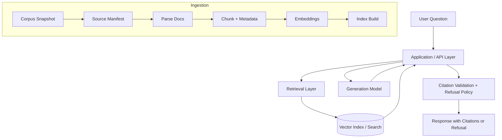

## 1. Project Overview

---

SupportDoc RAG Chatbot is a helper application that uses authorized documents to answer questions. It provides quotations from sources that allow you to verify its claims. This project seeks to minimize the provision of inaccurate or erroneous answers through retrieval-augmented generation (RAG), citation verification, and explicit refusal when evidence is insufficient.

Project goal: develop a full-scale web application with clearly demarcated stages of document retrieval, evidence discovery, generation, verification, and deployment. Briefly, the pipeline accepts an authorized snapshot of documents, structures it, sources it, identifies relevant evidence in the context of a question, generates an answer using an open-source language model, and outputs citations for each supported claim. If the evidence is inadequate, unreliable, or fails verification tests, the system refuses to provide an answer.

Dataset: a static snapshot of Kubernetes documentation to enable this project to test retrieval, grounding, and citation verification on a reproducible support-docs dataset.

---

## 2. Current Status

This README is maintained as a live project document and evolves with each completed task issue.

### Current Phase
API-first MVP validation with reviewed evidence, documented smoke paths, and source-of-truth cleanup.

### Completed
- Repository scaffolding for application, ingestion, retrieval, evaluation, and documentation.
- Corpus governance documentation in `docs/data/corpus.md`.
- Ingestion pipeline artifacts for manifest generation, parsing, section extraction, chunking, and validation.
- Local embedding job that converts `data/processed/chunks.jsonl` into deterministic dense-vector artifacts for downstream index construction.
- Local FAISS backend that builds, persists, reloads, and searches a dense index over saved embedding artifacts.
- Developer-facing retrieval smoke CLI for local dense search over a saved FAISS index.
- Shared retrieval evaluation harness plus dense, BM25, and hybrid baseline runners that execute the committed Dev QA set and write deterministic result artifacts.
- Retrieval comparison note documenting baseline configs, reference fixture metrics, trade-offs, and the provisional hybrid recommendation for later retrieval integration work.
- Canonical trust-layer `QueryResponse` schema with Pydantic validation, checked-in JSON Schema, example answer/refusal fixtures, and a local trust smoke command.
- Fixture-mode local API smoke path via `./scripts/run-api-local.sh`.
- Artifact-mode API smoke suite via `./scripts/smoke-artifact-api.sh`.
- Container runtime smoke validation via `./scripts/smoke-container-runtime.sh`.
- Final evidence review package under `docs/validation/` with a committed review set, rubric, results template, raw reviewed outputs, and reviewed summary.
- AWS baseline deployment notes plus companion cost / ops guidance under `docs/architecture/` and `docs/ops/`.

### In Progress
- Final MVP readiness closeout / summary documentation.

### Next Up
- Publish the final readiness report and closure checklist for Epic 10.


## 2A. Demo day quick start

"Fixture Mode" is the default option for running the local browser demo. This will start the backend with a known set of data before you introduce the retrieval artifacts. The "Artifact Mode" is the second alternative for running the demo after you have created the FAISS artifacts locally.

From the repo root:

```bash
uv sync --locked --extra dev-tools --extra faiss
./scripts/run-api-local.sh
```

Then in a second terminal:

```bash
cd frontend
npm ci
npm run dev
```

Default local endpoints:

- backend: `http://127.0.0.1:9001`
- browser UI: `http://127.0.0.1:5173`

Useful local overrides:

- `SUPPORTDOC_LOCAL_API_HOST=127.0.0.1`
- `SUPPORTDOC_LOCAL_API_PORT=9001`
- `SUPPORTDOC_LOCAL_API_RELOAD=true|false`
- `VITE_SUPPORTDOC_API_BASE_URL`

Optional artifact-mode backend startup:

```bash
SUPPORTDOC_LOCAL_API_MODE=artifact ./scripts/run-api-local.sh
```

The browser scaffold targets **Python 3.13** on the backend side and Node `^20.19.0 || >=22.12.0` on the frontend side.

---

## 3. Architecture Overview

The project follows a three-layer architecture:

### Model Layer
In this layer, the modules for embeddings and generation have been added. The current version of this project uses a lightweight sentence-transformers embedding module, which runs well even on a laptop. However, at some point later, this module can be replaced by E5, BGE, or even the embedding service.

### Application Layer
This is the main orchestration layer implemented in this repository. It is responsible for:
- corpus ingestion,
- manifest generation,
- parsing and chunking,
- embedding artifact generation,
- retrieval orchestration,
- answer generation,
- citation validation, and
- refusal enforcement.

### Infrastructure Layer
The MVP for deploy-now still maintains an **API-first** approach to the backend architecture; however, the repository now includes scaffolding code for a React SPA in the `frontend/` directory for the local browser demo and eventual browser-based AWS integration. The backend shell has been implemented for AWS compatibility, while browser hosting and AWS inference have been documented through
`docs/architecture/aws_deployment.md`.

### High-Level System Flow



---

## 4. Embedding Artifacts (Local MVP)

The local embedding step is intentionally backend-agnostic. It reads the canonical chunk artifact and writes:

- a row-major float32 vector artifact,
- a small JSON metadata artifact, and
- no index-specific files yet.

Default output paths:

- `data/processed/embeddings/chunk_embeddings.f32`
- `data/processed/embeddings/chunk_embeddings.metadata.json`

The metadata file records at least:

- source chunks path,
- embedding model name,
- vector dimension,
- row count,
- snapshot ID when all chunk rows share the same snapshot, and
- vector artifact path.

This keeps the embedding job reusable by FAISS, pgvector, or any later retrieval backend.

---


## 4A. Local FAISS Index Artifacts (MVP)

In the first dense retrieval index, we used FAISS with a flat index for inner products. When using cosine similarity, the vectors in the database are L2-normalized before storing them in the `IndexFlatIP` structure.

Default output paths:

- `data/processed/indexes/faiss/chunk_index.faiss`
- `data/processed/indexes/faiss/chunk_index.metadata.json`
- `data/processed/indexes/faiss/chunk_index.row_mapping.json`

The metadata sidecar records at least:

- backend name,
- metric,
- embedding model name,
- vector dimension,
- row count,
- source chunks path,
- embedding metadata path,
- vector artifact path, and
- snapshot ID when available.

The row-mapping artifact stores the chunk IDs in row order, so the FAISS index can focus on vector search while chunk provenance remains in the original `chunks.jsonl` artifact.

---

## 5. Repository Structure

```text
src/supportdoc_rag_chatbot/
  ingestion/              # Manifest, parse, chunk, validation pipeline
  retrieval/
    embeddings/           # Local embedding job + artifact I/O
    indexes/              # Dense index interfaces + local FAISS backend
    smoke.py              # Developer-facing dense retrieval smoke helpers
  app/                    # Backend orchestration entrypoints (to grow over time)
  evaluation/             # Dev QA loading, retrieval harness, and baseline runners
  resources/              # Default config and packaged resources

data/
  manifests/              # Source manifests
  parsed/                 # Section-level parsed artifacts
  processed/              # Chunk, embedding, and index artifacts

docs/
  adr/                    # Architecture decisions
  data/                   # Corpus and licensing docs
  diagrams/               # Architecture/ingestion diagrams
  process/                # Repo workflow and governance docs
```

---

## 6. Corpus and Licensing

The current MVP corpus is a pinned snapshot of Kubernetes documentation. Corpus governance, allowlist rules, and licensing decisions are documented in `docs/data/corpus.md` and the ADRs under `docs/adr/`.

---

## 7. Local Development

### Base environment

For normal repo development:

```bash
uv sync --locked --extra dev-tools
```

### Embedding job dependencies

For local embedding work, install the optional embedding dependencies too:

```bash
uv sync --locked --extra dev-tools --extra embeddings-local
```

### FAISS index dependencies

For local FAISS index work, install the FAISS extra:

```bash
uv sync --locked --extra dev-tools --extra faiss
```

If you want to run both the local embedding job and the local FAISS backend on the same machine, install both extras together:

```bash
uv sync --locked --extra dev-tools --extra embeddings-local --extra faiss
```

### Run the embedding job

After you have `data/processed/chunks.jsonl`, run:

```bash
uv run python -m supportdoc_rag_chatbot embed-chunks \
  --input data/processed/chunks.jsonl \
  --vectors-output data/processed/embeddings/chunk_embeddings.f32 \
  --metadata-output data/processed/embeddings/chunk_embeddings.metadata.json \
  --model-name sentence-transformers/all-MiniLM-L6-v2
```

Useful options:

- `--device cpu|cuda|mps`
- `--batch-size 32`
- `--no-normalize`

### Build the local FAISS index

After the embedding artifacts exist, build the persisted FAISS index:

```bash
uv run python -m supportdoc_rag_chatbot build-faiss-index \
  --embedding-metadata data/processed/embeddings/chunk_embeddings.metadata.json \
  --index-output data/processed/indexes/faiss/chunk_index.faiss \
  --index-metadata-output data/processed/indexes/faiss/chunk_index.metadata.json \
  --row-mapping-output data/processed/indexes/faiss/chunk_index.row_mapping.json
```

### Load the saved FAISS backend from Python

```python
from pathlib import Path

from supportdoc_rag_chatbot.retrieval.indexes import load_faiss_index_backend

backend = load_faiss_index_backend(
    index_path=Path("data/processed/indexes/faiss/chunk_index.faiss"),
    metadata_path=Path("data/processed/indexes/faiss/chunk_index.metadata.json"),
)
```

### Run a local dense-retrieval smoke test

After the FAISS index exists, run a query end to end:

```bash
uv run python -m supportdoc_rag_chatbot smoke-dense-retrieval \
  --query "what is a pod" \
  --top-k 3 \
  --index data/processed/indexes/faiss/chunk_index.faiss \
  --index-metadata data/processed/indexes/faiss/chunk_index.metadata.json
```

By default, the smoke command:

- loads the embedding model recorded in the FAISS index metadata,
- uses the row-mapping path recorded in the index metadata,
- uses the source `chunks.jsonl` path recorded in the index metadata, and
- prints rank, score, chunk ID, section path, source URL, and a short text preview.

Useful options:

- `--row-mapping data/processed/indexes/faiss/chunk_index.row_mapping.json`
- `--chunks data/processed/chunks.jsonl`
- `--model-name sentence-transformers/all-MiniLM-L6-v2`
- `--device cpu|cuda|mps`
- `--preview-chars 200`

### Local verification

Run the standard local verification pass:

```bash
uv sync --locked --extra dev-tools --extra faiss --extra bm25
uv run ruff check . --fix
uv run ruff format .
uv run ruff format --check .
uv run pre-commit run --all-files
uv run pytest -q tests/test_dense_retrieval_baseline.py tests/test_bm25_baseline.py tests/test_hybrid_baseline.py
uv run pytest -q
```

### Run the local trust-contract smoke test

```bash
uv run python -m supportdoc_rag_chatbot smoke-trust-schema \
  --schema docs/contracts/query_response.schema.json \
  --answer-fixture docs/contracts/query_response.answer.example.json \
  --refusal-fixture docs/contracts/query_response.refusal.example.json
```

### Run the local retrieval-sufficiency smoke test

```bash
uv run python -m supportdoc_rag_chatbot smoke-retrieval-sufficiency \
  --config src/supportdoc_rag_chatbot/resources/default_config.yaml
```

---

## 7A. Local API Smoke Workflow

EPIC 6 now includes a practical local API startup path for smoke testing from a clean checkout. The default startup mode is **fixture** so the API can boot without a model server or local retrieval artifacts.

### Refresh the locked environment

```bash
uv sync --locked --extra dev-tools --extra faiss
```

### Start the local API

```bash
./scripts/run-api-local.sh
```

That command:

- defaults to `SUPPORTDOC_LOCAL_API_MODE=fixture`,
- runs a startup preflight before launching Uvicorn, and
- starts `supportdoc_rag_chatbot.app.api:app` on `127.0.0.1:9001` by default.

### Fixture mode (default)

Fixture mode is the first-run local path. It returns deterministic, schema-valid responses using the checked-in trust fixtures and is intended for repo-only API smoke testing.

```bash
./scripts/run-api-local.sh
```

Example local smoke calls:

```bash
curl http://127.0.0.1:9001/healthz
curl http://127.0.0.1:9001/readyz
curl -X POST http://127.0.0.1:9001/query \
  -H 'content-type: application/json' \
  -d '{"question":"What is a Pod?"}'
```

### Artifact mode

Artifact mode is for local users who already generated `chunks.jsonl` plus the FAISS artifact set. The startup script still fails fast with clear guidance when any required files are missing, but the backend now also supports explicit artifact-path overrides so smoke fixtures can stay isolated from a developer's `data/processed/` state.

```bash
SUPPORTDOC_LOCAL_API_MODE=artifact ./scripts/run-api-local.sh
```

Default artifact locations remain:

- `data/processed/chunks.jsonl`
- `data/processed/indexes/faiss/chunk_index.faiss`
- `data/processed/indexes/faiss/chunk_index.metadata.json`
- `data/processed/indexes/faiss/chunk_index.row_mapping.json`

Optional artifact override environment variables:

- `SUPPORTDOC_QUERY_ARTIFACT_CHUNKS_PATH`
- `SUPPORTDOC_QUERY_ARTIFACT_INDEX_PATH`
- `SUPPORTDOC_QUERY_ARTIFACT_INDEX_METADATA_PATH`
- `SUPPORTDOC_QUERY_ARTIFACT_ROW_MAPPING_PATH`

By default, artifact mode uses the local embedding model recorded in the FAISS metadata. For the deterministic smoke suite only, the backend also supports a lightweight fixture embedder override:

- `SUPPORTDOC_QUERY_ARTIFACT_EMBEDDER_MODE=local|fixture`
- `SUPPORTDOC_QUERY_ARTIFACT_EMBEDDER_FIXTURE_PATH=/absolute/path/to/query_embedding_fixture.json`

### Canonical artifact-mode smoke command

Run the artifact-backed local API smoke path with a tiny deterministic fixture:

```bash
./scripts/smoke-artifact-api.sh
```

That command:

- creates a temporary `chunks.jsonl` + FAISS fixture,
- starts `./scripts/run-api-local.sh --mode artifact` with explicit artifact-path overrides,
- uses the smoke-only fixture embedder so no long-running model server or local embedding stack is required,
- validates `GET /healthz`, `GET /readyz`, and supported + refusal `POST /query` responses against the canonical `QueryResponse` contract, and
- removes the temporary fixture and background API process on exit.

Prerequisite:

```bash
uv sync --locked --extra dev-tools --extra faiss
```

For one place to find the fixture smoke path, artifact smoke path, container runtime smoke, and reviewed evidence artifacts, start at `docs/validation/README.md`.

### Optional local configuration

Set shell-wrapper options with flags or exported environment variables:

- `SUPPORTDOC_LOCAL_API_MODE=fixture|artifact`
- `SUPPORTDOC_LOCAL_API_HOST=127.0.0.1`
- `SUPPORTDOC_LOCAL_API_PORT=9001`
- `SUPPORTDOC_LOCAL_API_RELOAD=true|false`

Backend settings are loaded by `src/supportdoc_rag_chatbot/config.py` and use these environment variable names:

- `SUPPORTDOC_API_TITLE=SupportDoc RAG Chatbot API`
- `SUPPORTDOC_ENV=local`
- `SUPPORTDOC_API_VERSION=0.1.0`
- `SUPPORTDOC_API_DOCS_URL=/docs`
- `SUPPORTDOC_API_REDOC_URL=/redoc`
- `SUPPORTDOC_QUERY_RETRIEVAL_MODE=fixture|artifact`
- `SUPPORTDOC_QUERY_GENERATION_MODE=fixture|http`
- `SUPPORTDOC_QUERY_GENERATION_BASE_URL=http://127.0.0.1:8080`
- `SUPPORTDOC_QUERY_GENERATION_TIMEOUT_SECONDS=30`
- `SUPPORTDOC_QUERY_TOP_K=3`
- `SUPPORTDOC_QUERY_ARTIFACT_CHUNKS_PATH=/absolute/path/to/chunks.jsonl`
- `SUPPORTDOC_QUERY_ARTIFACT_INDEX_PATH=/absolute/path/to/chunk_index.faiss`
- `SUPPORTDOC_QUERY_ARTIFACT_INDEX_METADATA_PATH=/absolute/path/to/chunk_index.metadata.json`
- `SUPPORTDOC_QUERY_ARTIFACT_ROW_MAPPING_PATH=/absolute/path/to/chunk_index.row_mapping.json`
- `SUPPORTDOC_QUERY_ARTIFACT_EMBEDDER_MODE=local|fixture`
- `SUPPORTDOC_QUERY_ARTIFACT_EMBEDDER_FIXTURE_PATH=/absolute/path/to/query_embedding_fixture.json`

For example, to point the API at an HTTP generation backend:

```bash
SUPPORTDOC_QUERY_GENERATION_MODE=http \
SUPPORTDOC_QUERY_GENERATION_BASE_URL=http://127.0.0.1:8080 \
./scripts/run-api-local.sh
```

---

## 7B. Containerized Local API Smoke Workflow

The repository now includes a first-pass backend container package for the local API shell. It is intentionally small and reuses the existing `scripts/run-api-local.sh` startup path instead of introducing a parallel container-only boot flow.

### Build the backend image

```bash
docker build -f docker/backend.Dockerfile -t supportdoc-rag-chatbot-api:local .
```

The image:

- installs the locked runtime dependencies with `uv sync --locked --no-dev --extra embeddings-local`,
- defaults to `SUPPORTDOC_LOCAL_API_MODE=fixture`,
- starts the existing local API shell on `0.0.0.0:9001`,
- can boot either the checked-in fixture path or the cloud-backed `pgvector` + OpenAI-compatible path through environment variables,
- exposes port `9001`,
- defines a `/healthz` container healthcheck, and
- runs as the non-root `supportdoc` user.

### Canonical runtime smoke command

The CI build smoke proves that `docker/backend.Dockerfile` still builds. The runtime smoke below is the canonical **packaged-runtime** proof: it builds the checked-in image, starts it in fixture mode with `docker run`, waits for the container healthcheck, validates `GET /healthz` and `GET /readyz`, then checks one supported and one refusal `POST /query` response against the canonical `QueryResponse` contract.

```bash
./scripts/smoke-container-runtime.sh
```

The runtime smoke always removes the container on exit and prints container logs plus `docker inspect` state/port details when a check fails. The checked-in fixture smoke stays the boring, reliable first packaged-runtime proof. The same image can also boot the cloud-backed `pgvector` + OpenAI-compatible path when those dependencies are available.

### Cloud-backed runtime smoke

Use the cloud-backed smoke path when you already have a PostgreSQL + `pgvector` instance plus an OpenAI-compatible inference endpoint available locally or in a reachable dev environment. The script can optionally promote the current local embedding artifacts into PostgreSQL before it boots the backend image in cloud mode.

```bash
./scripts/smoke-cloud-runtime.sh \
  --database-url postgresql://... \
  --generation-base-url http://127.0.0.1:8080 \
  --generation-model demo-model
```

That path keeps the browser/API contract unchanged while proving the backend image can run with `SUPPORTDOC_QUERY_RETRIEVAL_MODE=pgvector` and `SUPPORTDOC_QUERY_GENERATION_MODE=openai_compatible`.

### Run the backend container directly

If you only want to boot the container manually without the full runtime validation wrapper, you can still run:

```bash
docker run --rm -p 9001:9001 supportdoc-rag-chatbot-api:local
```

### Run the local smoke stack with Docker Compose

`docker compose` remains optional for manual local stack management, but the canonical runtime smoke path for MVP validation is the script above.

```bash
docker compose up --build -d
docker compose ps
```

Example manual smoke calls against the running container:

```bash
curl http://127.0.0.1:9001/healthz
curl http://127.0.0.1:9001/readyz
curl -X POST http://127.0.0.1:9001/query \
  -H 'content-type: application/json' \
  -d '{"question":"What is a Pod?"}'
```

Stop the local container stack when you are done:

```bash
docker compose down
```

### Container environment variables

The compose service uses the same startup wrapper and backend settings already documented above. The default local container smoke path sets:

- `SUPPORTDOC_LOCAL_API_MODE=fixture`
- `SUPPORTDOC_LOCAL_API_HOST=0.0.0.0`
- `SUPPORTDOC_LOCAL_API_PORT=9001`
- `SUPPORTDOC_QUERY_GENERATION_MODE=fixture`

You can still override the backend-facing settings from `src/supportdoc_rag_chatbot/config.py` when needed, for example:

```bash
docker run --rm -p 9001:9001 \
  -e SUPPORTDOC_API_TITLE=SupportDoc Container API \
  -e SUPPORTDOC_ENV=container-local \
  supportdoc-rag-chatbot-api:local
```

### Artifact mode status

Artifact mode inside the container image is still deferred. The current container work closes the AWS-targeted cloud path, not the local-FAISS-in-container path:

- The image now includes the runtime needed for fixture mode plus cloud-backed `pgvector` retrieval with local query embedding,
- `./scripts/smoke-container-runtime.sh` remains the canonical fixture-first packaged smoke path,
- `./scripts/smoke-cloud-runtime.sh` is the cloud-backed packaged smoke path for `pgvector` + OpenAI-compatible inference, and
- The compose workflow is still intentionally fixture-first instead of defining a mount contract for local FAISS artifacts.

If artifact-mode container support is needed later, it should be added as an explicit follow-on task with a documented artifact mount/input contract rather than inferred ad hoc.

---


## 7C. Local browser demo scaffold

The thin local browser scaffold now lives under `frontend/` and is documented in `frontend/README.md`.

This is the checked-in React SPA scaffold under `frontend/` for the local browser demo. It stays intentionally thin and uses the backend contract documented in the `docs/process/browser_demo_contract.md` file.

Canonical local startup is:

```bash
./scripts/run-api-local.sh
cd frontend
npm ci
npm run dev
```

The local browser demo assumes **Python 3.13**, Node `^20.19.0 || >=22.12.0`, and a default API base URL of `VITE_SUPPORTDOC_API_BASE_URL=http://127.0.0.1:9001`.

For local platform-specific setup notes, see `docs/validation/local_workflow_platforms.md`.
For the manual browser smoke checklist, see `docs/validation/browser_smoke_checklist.md`.
For report-ready wording on the UI/backend split, see `docs/validation/report_and_aws_handoff_notes.md`.

## 8. Citations and Refusal Behavior

The repository now includes a canonical trust-layer response contract under `src/supportdoc_rag_chatbot/app/schemas/trust.py`. That contract defines structured supported answers, structured refusals, restricted refusal reason codes, and deterministic JSON Schema export under `docs/contracts/`.

Retrieval sufficiency gating now lives under `src/supportdoc_rag_chatbot/app/services/refusal_policy.py`, with shared request/decision types in `src/supportdoc_rag_chatbot/app/services/policy_types.py` and default thresholds in `src/supportdoc_rag_chatbot/resources/default_config.yaml`. The policy computes deterministic score aggregates, distinguishes `no_relevant_docs` from `insufficient_evidence`, emits machine-readable diagnostics for logging, and can cap thin answers before backend orchestration trusts model output.

Structured user-facing refusal rendering now lives under `src/supportdoc_rag_chatbot/app/services/refusal_builder.py`. It maps retrieval gating failures and citation validation failures into canonical `QueryResponse` refusals with stable reason-code-specific messages and optional next-step guidance.

---

## 9. Evaluation Plan / Results

Evaluation work is planned in two stages:

1. retrieval smoke tests and baseline relevance checks,
2. end-to-end answer quality, citation support, and refusal correctness.

Retrieval-only artifacts live under `data/evaluation/`. The current artifact-backed MVP trust pass now lives under `docs/validation/final_evidence_review.md`, with the versioned review set in `data/evaluation/final_evidence_review.k8s-9e1e32b.v1.jsonl`.

The canonical validation index for Epic 10 now lives at `docs/validation/README.md`.

## 9A. Development Retrieval QA Set

A small versioned development QA set now lives under `data/evaluation/` for retrieval-only baseline work. The current committed dataset targets snapshot `k8s-9e1e32b` from `data/manifests/source_manifest.jsonl` and includes answerable plus intentionally unanswerable questions, along with expected section/chunk evidence IDs for retrieval checks.

The evaluation helpers in `src/supportdoc_rag_chatbot/evaluation/dev_qa.py` can load the dataset, load the companion metadata/registry files, and validate that every annotated evidence ID belongs to the same snapshot. See `docs/process/retrieval_dev_qa.md` for the schema, annotation rules, and validation workflow.

## 9B. Hybrid Retrieval Baseline Evaluation

There is now a hybrid baseline runner in the codebase. This involves using Dense FAISS and Lexical BM25 retrievals in the Reciprocal Rank Fusion (RRF) method. The hybrid baseline combines ranked candidates from both retrieval methods, removes duplicates using deterministic chunk IDs, and generates deterministic runs in `data/evaluation/runs/`.

Default hybrid baseline command:

```bash
uv run python -m supportdoc_rag_chatbot run-hybrid-baseline \
  --chunks data/processed/chunks.jsonl \
  --index data/processed/indexes/faiss/chunk_index.faiss \
  --index-metadata data/processed/indexes/faiss/chunk_index.metadata.json \
  --top-k 5
```

The hybrid run writes:

- a per-query results JSONL artifact
- a summary JSON artifact with hit@k, recall@k, MRR, and latency

See `docs/process/hybrid_retrieval_baseline.md` for the default fusion strategy, exact baseline configuration, and output layout.

## 9C. Retrieval Comparison Note

There is a new comparison note for retrievals only in `docs/process/retrieval_comparison_notes.md`, which includes current baselines in Epic 4, the reference metrics from the shared evaluation harness, qualitative considerations, and a **tentative recommendation to use `hybrid-rrf` retrieval as the default choice for future work **.

Because the repository does not store local chunk/embedding/FAISS artifacts in its commit history, the comparison note distinguishes between reproducible fixture metrics and future runs on the full corpus once those artifacts become available. The latter is an evaluation artifact but not necessarily the implementation of the current API path.

## 9D. Validation index and reviewed trust artifacts

The final MVP validation materials are grouped under `docs/validation/`:

- `docs/validation/README.md` — entry point for smoke commands and reviewed trust artifacts
- `docs/validation/final_evidence_review.md` — reviewed evidence correctness summary
- `docs/validation/final_evidence_review_rubric.md` — reviewer rubric
- `docs/validation/final_evidence_review_results.template.md` — blank results template
- `docs/validation/final_evidence_review.first_pass.raw.json` — first reviewed pass raw outputs
- `docs/validation/final_evidence_review.final_pass.raw.json` — final reviewed pass raw outputs

## 9D. Final MVP readiness report

The single closeout status page for Epic 10 now lives at `docs/validation/mvp_readiness.md`. Start there when you need the current final-readiness decision, the pass/fail matrix for remaining MVP validation items, and the closure checklist that maps directly to the Epic 10 tasks.

---

## 10. Deployment Overview

The overall long-term strategy for the architecture is to use the FastAPI server backend with a front-end, persistent artifacts, a vector retrieval service, and a swappable generation backend. The **currently validated MVP scope in this repository remains backend-first**, but it also includes the local browser demo scaffold and the browser-safe public configuration seam, `VITE_SUPPORTDOC_API_BASE_URL`.

The deploy-now AWS slice remains the backend shell on ECS/ALB, running in fixture mode. This very same codebase also contains the initial cloud-based runtime execution path, including `pgvector` fetching, a promotion/load utility for PostgreSQL, an inference adapter that works with OpenAI-like chat-completion endpoints using vLLM or TGI endpoints, and, finally, cloud-runtime smoke tests packaged in a single bundle. Similarly, the first browser-based AWS slice continues to use the same backend API contract, along with its own hosted frontend, accessing it via the `VITE_SUPPORTDOC_API_BASE_URL`.

The canonical AWS deployment baseline for that path now lives in `docs/architecture/aws_deployment.md`, with the rendered diagram in `docs/diagrams/aws_deployment.md` and the versioned Mermaid source in `docs/diagrams/aws_deployment.mmd`.

The concrete EPIC 12 / Task 1 implementation now lives under `infra/aws/task1-foundation/`, with the repo-aligned operator contract in `docs/ops/aws_task1_foundation.md`, the one-time AWS bootstrap JSON artifacts under `infra/aws/task1-foundation/bootstrap/`, the GitHub OIDC workflow in `.github/workflows/terraform-task1-foundation.yml`, and the verification helper in `scripts/verify-aws-task1.sh`.

For copy-ready report wording on the baseline no-fine-tuning answer, the snapshot -> parse -> chunk -> embed -> index preparation flow, and the UI/AWS handoff boundary, use `docs/validation/report_and_aws_handoff_notes.md`.

---

## 11. Documentation Map / Source of Truth

- `docs/process/git_workflow.md` — branch / PR / lockfile workflow
- `docs/data/corpus.md` — corpus scope and licensing notes
- `docs/diagrams/ingestion_pipeline.md` — ingestion pipeline overview
- `docs/validation/README.md` — validation entry point for fixture smoke, artifact smoke, container runtime smoke, cloud runtime smoke, and reviewed trust artifacts
- `docs/architecture/aws_deployment.md` — canonical AWS deployment baseline, deploy-now scope, and deferred options
- `infra/aws/task1-foundation/` — Terraform stack for the EPIC 12 / Task 1 AWS foundation and HTTPS entry point
- `infra/aws/task1-foundation/bootstrap/` — one-time AWS bootstrap JSON artifacts for the Task 1.1 OIDC role and state-bucket policies
- `docs/ops/aws_task1_foundation.md` — repo-aligned Task 1 env/secret contract and Task 1.1 deploy-control-plane notes
- `.github/workflows/terraform-task1-foundation.yml` — GitHub Actions OIDC workflow for PR plan / main apply on the Task 1 foundation stack
- `docs/diagrams/aws_deployment.md` — AWS deployment diagram
- `docs/adr/` — architecture decisions and project rationale
- `docs/process/hybrid_retrieval_baseline.md` — default hybrid baseline config and run command
- `docs/process/retrieval_comparison_notes.md` — Epic 4 baseline comparison and provisional default selection
- `docs/process/trust_response_contract.md` — canonical response contract, schema artifact, and smoke command
- `docs/process/browser_demo_contract.md` — browser-demo integration contract for the thin local React + FastAPI flow
- `frontend/README.md` — frontend startup, local API wiring, and browser demo smoke entry points
- `docs/validation/local_workflow_platforms.md` — macOS arm64 / Pop!_OS x86_64 local workflow notes for the browser demo
- `docs/validation/browser_smoke_checklist.md` — manual browser smoke checklist and short presentation sequence
- `docs/process/refusal_response_builder.md` — canonical refusal messages and builder entry points
- `docs/validation/final_evidence_review.md` — reviewed evidence correctness summary for the current MVP trust pass
- `docs/validation/report_and_aws_handoff_notes.md` — report-ready baseline notes for no fine-tuning, retrieval preparation flow, and the UI/AWS handoff boundary
- `PROPOSAL.md` — historical proposal/delivery framing only; do not treat it as the operational source of truth
- `docs/validation/mvp_readiness.md` — final MVP readiness decision, pass/fail matrix, and Epic 10 closure checklist
- `docs/process/retrieval_dev_qa.md` — development QA schema, annotation rules, and retrieval validation workflow
- `docs/diagrams/aws_deployment.mmd` — versioned Mermaid source for the AWS deployment diagram
- `docs/contracts/` — generated trust-contract schema and checked-in answer/refusal fixtures
