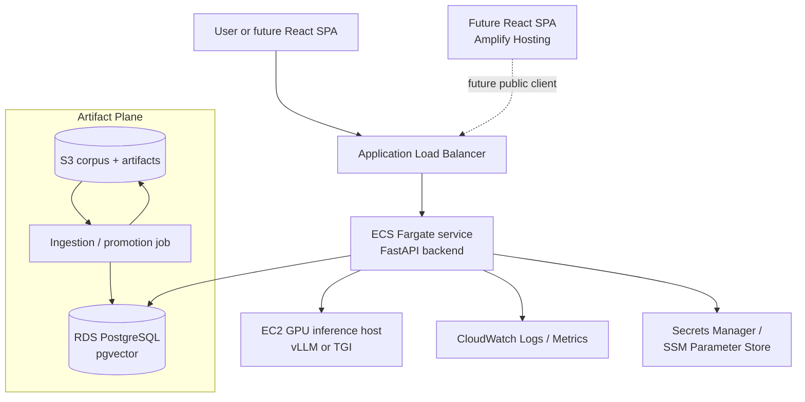

# AWS Deployment Diagram

Canonical AWS deployment diagram for the SupportDoc RAG Chatbot baseline described in `docs/architecture/aws_deployment.md`.

Source of truth: `docs/diagrams/aws_deployment.mmd`

