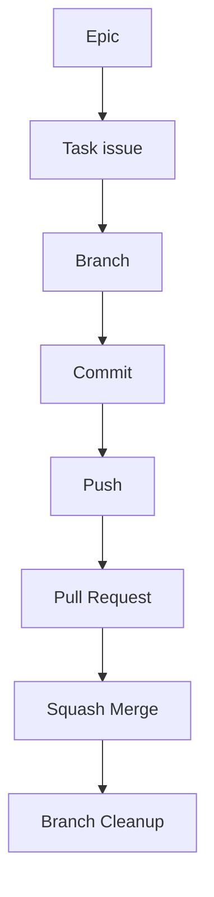

# GitHub Workflow for Epics

This document captures the GitHub workflow agreed during planning and setup for the `supportdoc-rag-chatbot` repository.

## 1. Goal

Use GitHub Issues, sub-issues, branches, and pull requests in a clean, traceable way:

- Epics define large work areas.
- Task issues define executable work.
- Each task issue gets its own branch.
- Each branch gets its own PR.
- `main` stays protected and stable.
- Merges happen through squash merge.

---

## 2. Core workflow model

The standard workflow for this repository is:



This is the default implementation path for all future work.

---

## 3. Epic model

An Epic is a parent issue used to group related work.

Examples already defined in the repo include:

- `[EPIC 0] Project foundations (repo + decisions + DoD)`
- `[EPIC 1] Corpus snapshot + licensing compliance`
- `[EPIC 2] Ingestion pipeline (parse -> chunk -> metadata)`
- `[EPIC 3] Embeddings + vector index (local MVP first)`
- `[EPIC 4] Retrieval baselines (dense / BM25 / hybrid)`
- `[EPIC 5] Citation contract + refusal policy (trust layer)`
- `[EPIC 6] Backend API (FastAPI orchestration)`
- `[EPIC 9] Infra notes (AWS plan + deployment readiness)`
- `[EPIC 10] Final readiness checklist (MVP validation)`

### Important rule

Do **not** implement an Epic directly.

Break the Epic into task issues and implement those one by one.

---

## 4. When to create a sub-issue

Create a sub-issue when the work:

- produces a committed artifact,
- changes repo structure,
- defines process or governance,
- deserves its own PR,
- or is large enough to be tracked independently.

### Good examples of sub-issues

- Create repo skeleton + conventions
- Create README with architecture overview
- Define Definition of Done
- Create decision ADR (Architecture Decision Record)
- Define Git workflow and branching conventions
- Setup linting + formatting
- Setup minimal CI pipeline

### Optional governance/config issues

These can also be tracked as sub-issues if you want an audit trail:

- Configure branch protection rules
- Configure PR settings + squash policy

---

## 5. Creating a sub-issue in GitHub

From inside an Epic issue, click **Create sub-issue**.

GitHub will show a template picker.

### What to choose

Choose:

```text
TASK — Work item
```

Do **not** choose the Epic template again.

If you started from **Create sub-issue** inside the Epic, GitHub will already attach the new issue to that Epic as the parent.

### Example sub-issue title

```text
Define Git workflow and branching conventions
```

### Example sub-issue description

```markdown
Document repository Git workflow and contribution conventions.

Topics:
- Branch creation workflow from issues
- Branch naming conventions
- Commit message conventions
- Local workflow (commit -> push -> PR)
- Pull request process
- Branch cleanup after merge

Deliverable:
docs/process/git_workflow.md
```

---

## 6. Recommended Epic 0 sub-issues

For **Epic 0 – Project foundations**, the recommended child issues are:

- Create repo skeleton + conventions
- Create README with architecture overview
- Define Definition of Done
- Create ADR framework
- Define Git workflow and branching conventions
- Setup linting + formatting
- Setup minimal CI pipeline

Optional:

- Configure branch protection rules
- Configure PR settings + squash policy

---

## 7. Branch protection and repository governance

Protect the `main` branch.

### Branch protection rule

In GitHub branch protection, the branch name pattern should literally be:

```text
main
```

### Recommended protection settings for `main`

- Require pull request before merging
- Require at least 1 approval
- Require conversation resolution
- Do not allow direct pushes
- Do not allow force pushes
- Do not allow branch deletion

---

## 8. Pull request settings

Recommended PR settings:

- Disable merge commits
- Enable squash merging
- Rebase merging optional
- Enable automatic deletion of head branches
- Enable “suggest updating pull request branches”
- Enable auto-merge optionally for later CI use

### Merge strategy

Use:

```text
Squash and merge
```

---

## 9. Recommended repository features

Recommended enabled features:

- Issues
- Projects
- Pull Requests
- Wiki (optional)
- Discussions (recommended)

---

## 10. Branch naming convention

Use this branch pattern:

```text
<type>/<issue-number>-short-description
```

### Examples

```text
feat/10-repo-skeleton
feat/11-readme-architecture
docs/12-definition-of-done
chore/14-linting-setup
fix/27-citation-parser
```

### Recommended branch types

- `feat` -> new functionality
- `fix` -> bug fix
- `docs` -> documentation
- `chore` -> maintenance, tooling, repo setup
- `refactor` -> code cleanup without behavior change
- `test` -> tests

---

## 11. `git switch` vs `git checkout`

Prefer `git switch` for branch operations.

### Recommended

```bash
git switch -c feat/10-repo-skeleton
```

### Older equivalent

```bash
git checkout -b feat/10-repo-skeleton
```

### Why prefer `switch`

`git switch` is clearer for branch operations, while `checkout` is overloaded.

Use:

```bash
git switch main
git switch -c feat/11-readme-architecture
```

---

## 12. Local workflow for a task issue

### Step 1: start from updated `main`

```bash
git switch main
git pull origin main
```

### Step 2: create a branch from the issue

Example for issue `#10`:

```bash
git switch -c feat/10-repo-skeleton
```

### Step 3: make changes locally

Before committing, run the local quality gates so your branch matches the repository workflow and GitHub Actions behavior as closely as possible.

Recommended commands:

```bash
uv sync --locked --extra dev-tools
uv run pre-commit run --all-files
uv run pytest -q
```

Notes:

- `uv sync --locked --extra dev-tools` ensures the local environment matches the committed lockfile and the default development toolchain.
- `uv run pre-commit run --all-files` runs the configured formatting and lint hooks consistently.
- `uv run pytest -q` runs the test suite inside the project environment.
- If `pre-commit` modifies files, stage them again with `git add ...` before committing.


### Optional extras for task-specific work

Some task issues require optional dependency groups beyond the default development tools. Install the extras needed by the task on your feature branch and document them in the PR when they affect local workflow or CI.

Examples:

```bash
uv sync --locked --extra dev-tools --extra embeddings-local
uv sync --locked --extra dev-tools --extra faiss
uv sync --locked --extra dev-tools --extra embeddings-local --extra faiss
```

If a new task requires CI to exercise an optional backend, update the relevant GitHub Actions workflow in the same PR instead of assuming the default `dev-tools` environment is enough.

### Step 4: commit

Example commit message:

```text
feat: create repo skeleton and development conventions
```

This matches a clean Conventional Commits style.

### Step 5: push the branch

```bash
git push -u origin feat/10-repo-skeleton
```

---

## 13. Commit conventions

Use Conventional Commit style.

### Examples

```text
feat: create repo skeleton and development conventions
docs: add README with architecture overview
chore: configure linting and formatting
fix: correct package path for src layout
```

---

## 14. Pull request workflow

Each task issue should map to one focused PR.

### PR title example

```text
feat: create repo skeleton and conventions
```

### PR description

Always include the issue reference:

```text
Closes #10
```

This lets GitHub automatically close the linked issue when the PR is merged.

### Before merging, verify

- base branch is `main`
- no accidental junk files are committed
- file structure is correct
- package/module naming is correct
- `uv run pre-commit run --all-files` passes locally
- `uv run pytest -q` passes locally
- issue reference is present in the PR description

---

## 15. Example end-to-end flow for issue #10

Issue:

```text
#10 Create repo skeleton + conventions
```

### Local work

```bash
git switch main
git pull origin main
git switch -c feat/10-repo-skeleton
```

Work locally, then run the repository checks:

```bash
uv sync --locked --extra dev-tools
uv run pre-commit run --all-files
uv run pytest -q
```

If hooks modify files, stage them again and continue:

```bash
git add .
git commit -m "feat: create repo skeleton and development conventions"
git push -u origin feat/10-repo-skeleton
```

### Pull request

- Title: `feat: create repo skeleton and conventions`
- Body: `Closes #10`

### Merge

- Use **Squash and merge**
- Example final squash message:

```text
feat: create repo skeleton and conventions (#10)
```

---

## 16. Local cleanup after merge

After the PR is merged:

### Step 1: switch back to `main`

```bash
git switch main
```

### Step 2: pull latest changes

```bash
git pull origin main
```

### Step 3: delete the merged local branch

```bash
git branch -d feat/10-repo-skeleton
```

If Git complains in an edge case:

```bash
git branch -D feat/10-repo-skeleton
```

### Step 4: prune deleted remote refs

```bash
git fetch --prune
```

---

## 17. Definition of done for a task issue

A task issue is done when:

- implementation is committed,
- local quality checks pass (`uv run pre-commit run --all-files` and `uv run pytest -q`),
- branch is pushed,
- PR is opened,
- PR includes `Closes #<issue-number>`,
- PR is squash-merged into `main`,
- issue is automatically closed,
- local feature branch is deleted,
- Epic progress is updated.

---

## 18. Working rules for this repository

- Use one task issue per meaningful unit of work.
- Keep branches short-lived.
- Keep PRs focused.
- Prefer clean history over large mixed commits.
- Run `uv run pre-commit run --all-files` before committing.
- Run `uv run pytest -q` before opening or updating a PR.
- Implement sub-issues, not the Epic directly.
- When creating a sub-issue from an Epic, choose **TASK — Work item**.
- Use `git switch` instead of `git checkout` for branch changes.
- Use squash merge into `main`.

---

## 12. Dependency and lockfile workflow

When a task changes `pyproject.toml`, regenerate and commit `uv.lock` in the **same branch and PR**.

### Required commands

```bash
git switch -c <type>/<issue-number>-short-description
uv lock
uv sync --locked --extra dev-tools
```

If the task depends on local embedding models, use:

```bash
uv sync --locked --extra dev-tools --extra embeddings-local
```

### Rule of thumb

- `pyproject.toml` changed -> run `uv lock`
- lockfile changed -> commit `pyproject.toml` and `uv.lock` together
- CI should continue using locked installs for reproducibility
